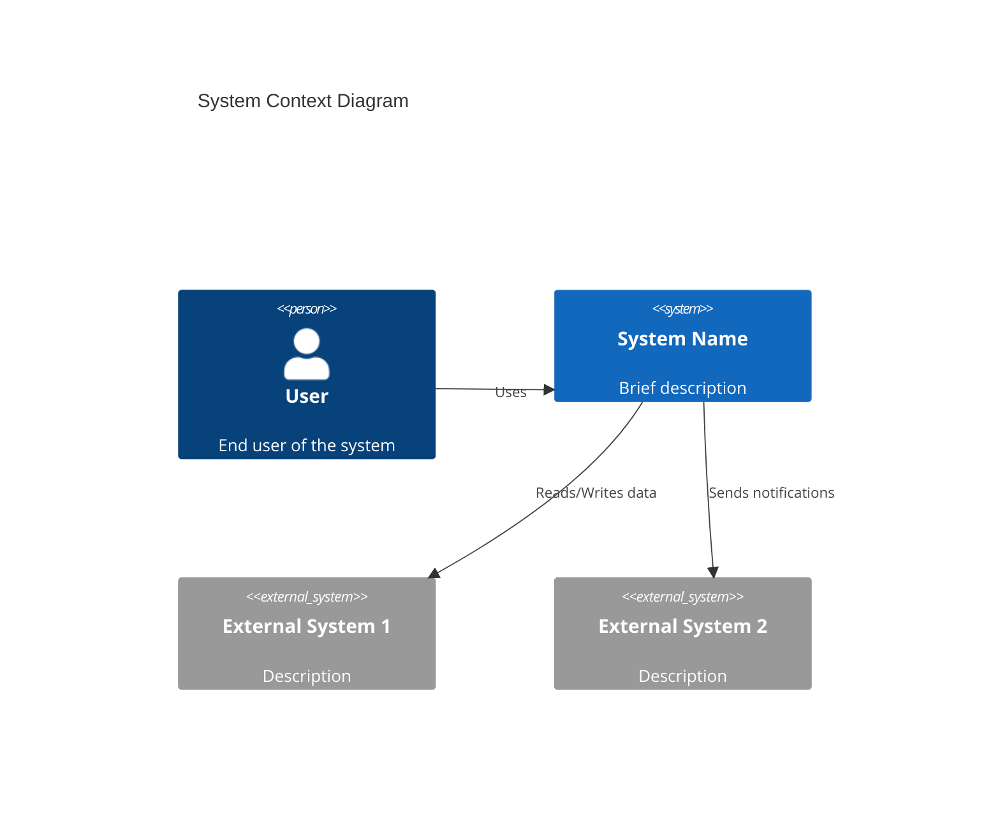
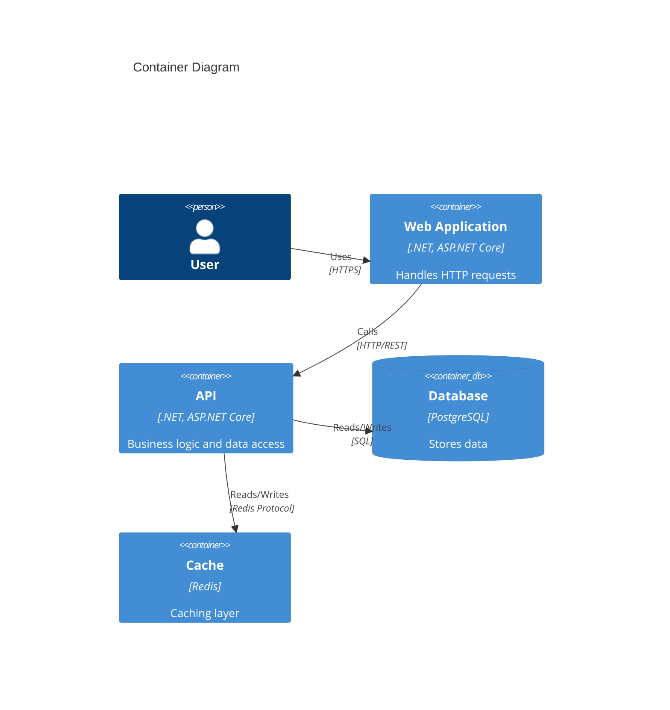
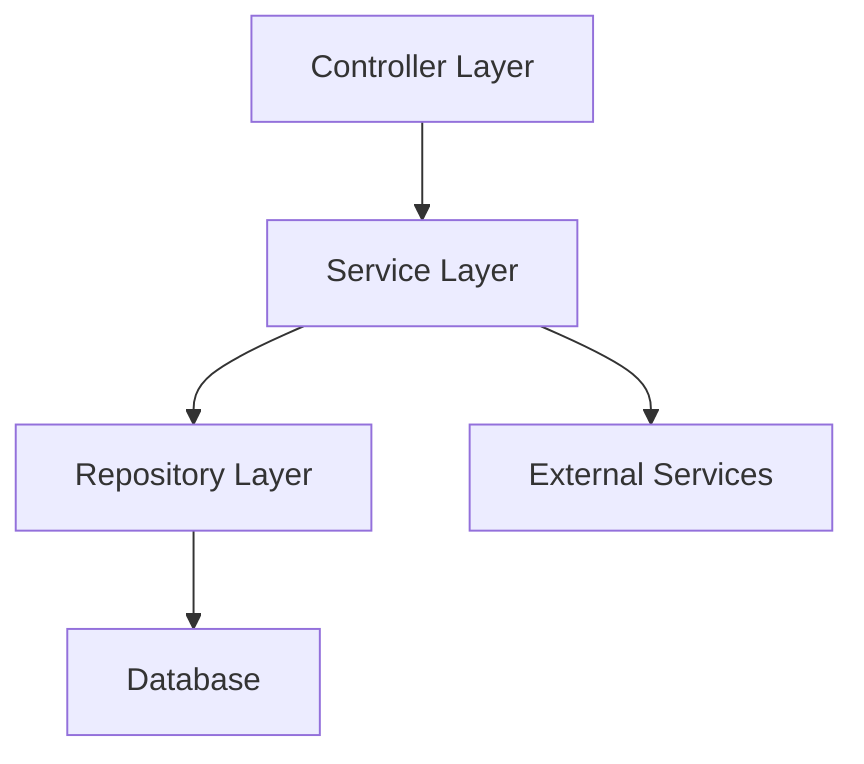
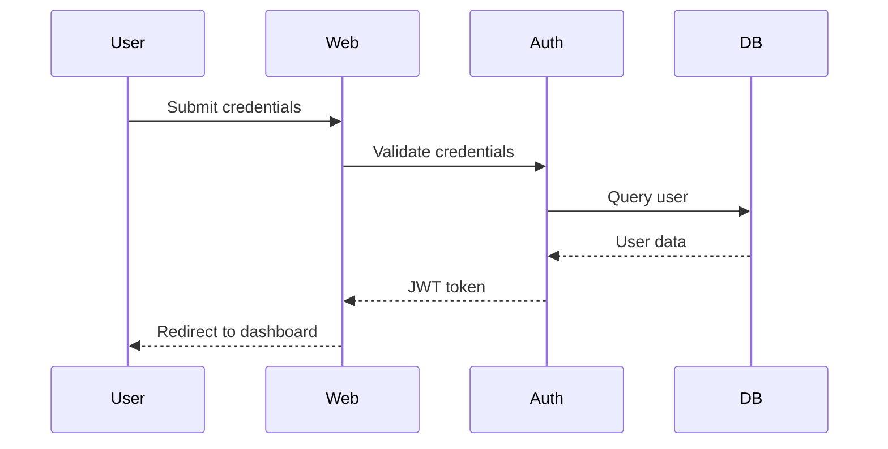
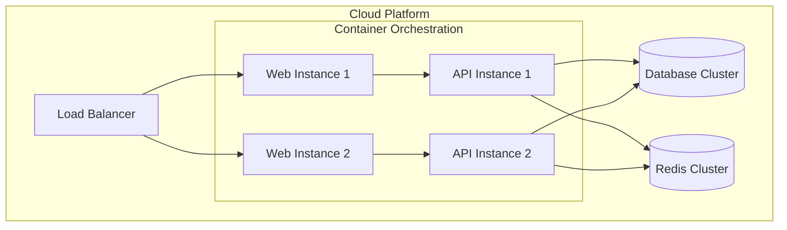

# Architecture Documentation (arc42)

**Project:** [Project Name]  
**Version:** 1.0  
**Date:** [YYYY-MM-DD]  
**Status:** Draft / In Review / Approved

---

## About arc42

This document follows the [arc42 template](https://arc42.org/) for architecture documentation. arc42 is a proven, practical template for software architecture communication and documentation.

---

## 1. Introduction and Goals

### 1.1 Requirements Overview

**Brief description of the system's functional requirements and driving forces.**

- [Requirement 1]
- [Requirement 2]
- [Requirement 3]

**Links to detailed requirements:**
- [docs/spec.md](../../spec.md)
- [Feature specifications in docs/features/](../../features/)

### 1.2 Quality Goals

**Top 3-5 quality goals for the architecture, in priority order.**

| Priority | Quality Goal | Scenario |
|----------|-------------|----------|
| 1 | [e.g., Performance] | [e.g., System responds within 200ms for 95% of requests] |
| 2 | [e.g., Maintainability] | [e.g., New features can be added without modifying core components] |
| 3 | [e.g., Security] | [e.g., All data at rest is encrypted] |

### 1.3 Stakeholders

**People, roles, or organizations that should know about the architecture.**

| Role/Name | Expectations | Concerns |
|-----------|-------------|----------|
| [e.g., Product Owner] | [e.g., Feature delivery speed] | [e.g., Cost vs. quality trade-offs] |
| [e.g., Development Team] | [e.g., Clear design, testability] | [e.g., Technical debt, complexity] |
| [e.g., Operations Team] | [e.g., Reliable deployment] | [e.g., Monitoring, incident response] |
| [e.g., End Users] | [e.g., Fast, intuitive interface] | [e.g., Data privacy, availability] |

---

## 2. Constraints

### 2.1 Technical Constraints

| Constraint | Background / Motivation |
|------------|------------------------|
| [e.g., Must use .NET 8] | [e.g., Organizational standard] |
| [e.g., Deploy on Linux containers] | [e.g., Infrastructure requirement] |
| [e.g., Use PostgreSQL] | [e.g., Existing database platform] |

### 2.2 Organizational Constraints

| Constraint | Background / Motivation |
|------------|------------------------|
| [e.g., Team size: 3 developers] | [e.g., Limits complexity of solution] |
| [e.g., Budget: $X/month for cloud] | [e.g., Affects infrastructure choices] |
| [e.g., Release every 2 weeks] | [e.g., CI/CD requirements] |

### 2.3 Conventions

| Convention | Description |
|------------|-------------|
| [e.g., C# Coding Standards] | [e.g., Microsoft conventions, enforced by .editorconfig] |
| [e.g., Git workflow] | [e.g., Feature branches, rebase-merge strategy] |
| [e.g., Documentation] | [e.g., Markdown in docs/, ADRs for decisions] |

---

## 3. Context and Scope

### 3.1 Business Context

**Diagram showing the system's environment and external entities.**



**Communication Partners:**

| Partner | Input | Output |
|---------|-------|--------|
| [e.g., User] | [e.g., HTTP requests] | [e.g., HTML pages, JSON responses] |
| [e.g., External API] | [e.g., Data feed] | [e.g., Processed results] |

### 3.2 Technical Context

**Technical interfaces and protocols.**

| Interface | Description | Protocol/Format |
|-----------|-------------|-----------------|
| [e.g., REST API] | [e.g., Public API for clients] | [e.g., HTTPS, JSON] |
| [e.g., Database] | [e.g., Persistent storage] | [e.g., PostgreSQL, SQL] |
| [e.g., Message Queue] | [e.g., Async processing] | [e.g., RabbitMQ, AMQP] |

---

## 4. Solution Strategy

**Fundamental decisions and solution approaches to achieve quality goals.**

| Quality Goal | Approach | Rationale |
|--------------|----------|-----------|
| [e.g., Performance] | [e.g., Caching layer with Redis] | [e.g., Reduces database load, improves response time] |
| [e.g., Maintainability] | [e.g., Modular architecture with clear boundaries] | [e.g., Enables independent module evolution] |
| [e.g., Security] | [e.g., OAuth 2.0 authentication] | [e.g., Industry standard, supports SSO] |

**Key Technology Decisions:**
- [e.g., ASP.NET Core for web framework]
- [e.g., Entity Framework Core for data access]
- [e.g., Docker for containerization]

**Architectural Patterns:**
- [e.g., Layered architecture (Presentation, Business Logic, Data Access)]
- [e.g., Repository pattern for data abstraction]
- [e.g., Dependency injection for loose coupling]

---

## 5. Building Block View

### 5.1 Level 1: System Overview

**High-level decomposition into major components.**



**Components:**

| Component | Responsibility | Interfaces |
|-----------|----------------|------------|
| [e.g., Web Application] | [e.g., User interface, routing] | [e.g., HTTP endpoints] |
| [e.g., API] | [e.g., Business logic, validation] | [e.g., REST API] |
| [e.g., Database] | [e.g., Persistent storage] | [e.g., SQL queries] |

### 5.2 Level 2: [Component Name] Internal Structure

**Detailed view of a specific component (repeat for each major component).**



**Sub-components:**
- [Sub-component 1]: [Description]
- [Sub-component 2]: [Description]

---

## 6. Runtime View

### 6.1 Scenario 1: [e.g., User Login]

**Description:** [What happens when a user logs in]



**Steps:**
1. User submits credentials via login form
2. Web application forwards to authentication service
3. Authentication service validates against database
4. JWT token is generated and returned
5. User is redirected to dashboard with session

### 6.2 Scenario 2: [e.g., Process Data]

**Description:** [What happens when data is processed]

[Add sequence diagram and step-by-step description]

---

## 7. Deployment View

### 7.1 Infrastructure

**How the system is deployed in production.**



**Nodes:**

| Node | Description | Technology |
|------|-------------|------------|
| [e.g., Load Balancer] | [e.g., Distributes traffic] | [e.g., Nginx, cloud LB] |
| [e.g., Web Instances] | [e.g., Frontend servers] | [e.g., Docker containers on Kubernetes] |
| [e.g., API Instances] | [e.g., Backend servers] | [e.g., Docker containers on Kubernetes] |
| [e.g., Database] | [e.g., Data storage] | [e.g., PostgreSQL managed service] |

### 7.2 Environments

| Environment | Purpose | Configuration |
|-------------|---------|---------------|
| Development | Local development | Docker Compose on developer machines |
| Staging | Pre-production testing | Cloud-hosted, mirrors production |
| Production | Live system | Cloud-hosted, scaled for load |

---

## 8. Crosscutting Concepts

### 8.1 Domain Model

**Key domain entities and their relationships.**

[Add class diagram or entity-relationship diagram]

### 8.2 Security

**Security concepts applied across the system.**

- **Authentication:** [e.g., OAuth 2.0 with JWT tokens]
- **Authorization:** [e.g., Role-based access control (RBAC)]
- **Data Protection:** [e.g., TLS for transit, AES-256 for rest]
- **Input Validation:** [e.g., Server-side validation, parameterized queries]

### 8.3 Error Handling

**How errors are handled consistently.**

- **Logging:** [e.g., Structured logging with Serilog, centralized in ELK stack]
- **Error Responses:** [e.g., Standard error format with HTTP status codes]
- **Monitoring:** [e.g., Health checks, alerting on critical errors]

### 8.4 Testing

**Testing strategies and conventions.**

- **Unit Tests:** [e.g., xUnit, mocked dependencies]
- **Integration Tests:** [e.g., TestContainers for database]
- **End-to-End Tests:** [e.g., Selenium/Playwright for UI]
- **Coverage Goal:** [e.g., >80% for critical paths]

### 8.5 Configuration Management

**How configuration is managed.**

- **Approach:** [e.g., Environment variables, appsettings.json]
- **Secrets:** [e.g., Azure Key Vault, never in source control]
- **Feature Flags:** [e.g., LaunchDarkly for gradual rollouts]

---

## 9. Architecture Decisions

**Important architecture decisions documented as ADRs.**

This section links to existing Architecture Decision Records (ADRs) in the repository. Each ADR documents a specific architectural choice, alternatives considered, and the rationale.

### Existing ADRs

| ADR | Title | Status | Date |
|-----|-------|--------|------|
| [ADR-001](../../adr-001-example.md) | [Decision Title] | [Accepted/Superseded] | [YYYY-MM-DD] |
| [ADR-002](../../adr-002-example.md) | [Decision Title] | [Accepted] | [YYYY-MM-DD] |

### Key Decisions Not Yet Documented

- [Decision 1]: [Brief description - create ADR]
- [Decision 2]: [Brief description - create ADR]

**Note:** For new architectural decisions, create standalone ADR files following the template in existing `adr-*.md` files, then reference them here.

---

## 10. Quality Requirements

### 10.1 Quality Tree

**Hierarchy of quality goals with concrete scenarios.**

```
Quality
├── Performance
│   ├── Response Time (< 200ms for 95% of requests)
│   └── Throughput (1000 requests/second)
├── Reliability
│   ├── Availability (99.9% uptime)
│   └── Recoverability (< 5 min recovery time)
├── Security
│   ├── Authentication (OAuth 2.0)
│   └── Data Encryption (TLS 1.3, AES-256)
└── Maintainability
    ├── Testability (80% code coverage)
    └── Modularity (low coupling, high cohesion)
```

### 10.2 Quality Scenarios

**Concrete scenarios to validate quality attributes.**

| ID | Quality | Scenario | Response | Measure |
|----|---------|----------|----------|---------|
| QS-1 | Performance | User requests page | Page loads | < 200ms for 95% of requests |
| QS-2 | Reliability | Database fails | System switches to replica | < 30s downtime |
| QS-3 | Security | Unauthorized access attempt | System denies access | 100% blocked |
| QS-4 | Maintainability | New feature added | Developer implements | < 2 days without modifying core |

---

## 11. Risks and Technical Debt

### 11.1 Risks

**Known risks and mitigation strategies.**

| Risk | Probability | Impact | Mitigation |
|------|-------------|--------|------------|
| [e.g., Database performance degrades under load] | Medium | High | [e.g., Implement caching, optimize queries, add read replicas] |
| [e.g., Third-party API becomes unavailable] | Low | Medium | [e.g., Implement circuit breaker, fallback mechanism] |
| [e.g., Security vulnerability in dependency] | Medium | High | [e.g., Automated dependency scanning, regular updates] |

### 11.2 Technical Debt

**Known technical debt items and prioritization.**

| Item | Description | Impact | Priority | Plan |
|------|-------------|--------|----------|------|
| [e.g., Legacy module not covered by tests] | [e.g., Module X has 0% test coverage] | High | High | [e.g., Add tests incrementally during maintenance] |
| [e.g., Outdated framework version] | [e.g., Using .NET 6, latest is .NET 8] | Medium | Medium | [e.g., Upgrade in Q2 2025] |
| [e.g., Tight coupling between layers] | [e.g., Controllers directly access DB] | Medium | Low | [e.g., Refactor to use repository pattern] |

---

## 12. Glossary

**Important domain and technical terms.**

| Term | Definition |
|------|------------|
| [e.g., Tenant] | [e.g., An isolated customer instance within a multi-tenant system] |
| [e.g., ADR] | [e.g., Architecture Decision Record - documents significant architectural decisions] |
| [e.g., JWT] | [e.g., JSON Web Token - compact, URL-safe token format for authentication] |
| [e.g., RBAC] | [e.g., Role-Based Access Control - authorization based on user roles] |
| [e.g., SLA] | [e.g., Service Level Agreement - commitment to availability and performance] |

---

## Appendix

### A. References

- [Project Specification](../../spec.md)
- [Existing ADRs](../../)
- [arc42 Template](https://arc42.org/)
- [C4 Model](https://c4model.com/)

### B. Revision History

| Version | Date | Author | Changes |
|---------|------|--------|---------|
| 1.0 | [YYYY-MM-DD] | [Name] | Initial version |

---

**Note:** This document is a living artifact. Update sections as the architecture evolves, particularly after significant design decisions or implementation changes.
