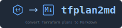

# tfplan2md



[](https://github.com/oocx/tfplan2md/actions/workflows/ci.yml) [](https://github.com/oocx/tfplan2md/actions/workflows/release.yml) [](https://opensource.org/licenses/MIT) [](https://hub.docker.com/r/oocx/tfplan2md) [](https://dotnet.microsoft.com/) [](https://hub.docker.com/r/oocx/tfplan2md) [](https://www.terraform.io/) [](https://github.com/features/copilot) [](https://conventionalcommits.org)

Convert Terraform plan JSON files into human-readable Markdown reports.

**NOTE:** This project was developed 100% with GitHub Copilot to explore how far AI-assisted development can go. All code and specifications were generated with AI support.

## Use Cases

### Pull Request Reviews

Terraform plans are notoriously difficult to review in pull requests:

- **Wall of text output** - Raw `terraform plan` output is verbose and hard to scan
- **No structure** - Changes aren't grouped logically, making it difficult to understand impact
- **Cryptic JSON** - `terraform show -json` provides complete data but is unreadable for humans
- **Index-based diffs** - Changes to lists show as confusing index modifications (e.g., `firewall_rule[2]` deleted, `firewall_rule[1]` modified)
- **Lost context** - Hard to see the big picture: "What's actually changing and why?"

**tfplan2md solves this** by generating clean, readable Markdown reports that:

- ✅ **Structure changes logically** - Group by module, summarize by action type
- ✅ **Show semantic diffs** - See which firewall rules or NSG rules were added/removed, not index changes
- ✅ **Highlight key changes** - One-line summaries show what changed in each resource at a glance
- ✅ **Format for readability** - Collapsible sections, tables, and syntax highlighting make review efficient
- ✅ **Render natively** - GitHub and Azure DevOps display reports beautifully in PR comments

**Result:** Reviewers can quickly understand infrastructure changes, catch potential issues, and approve confidently.

### Other Use Cases

- **Release documentation** - Attach plan reports to release notes for audit trails
- **Compliance audits** - Generate human-readable change documentation for compliance reviews
- **Team communication** - Share infrastructure changes with stakeholders who don't read Terraform code
- **CI/CD integration** - Automatically post plan summaries to PRs, Slack, or Teams

## Features

- 📄 **Convert Terraform plans to Markdown** - Generate clean, readable reports from `terraform show -json` output
- ✅ **Validated markdown output** - Comprehensive testing ensures GitHub/Azure DevOps compatibility
- 🔒 **Sensitive value masking** - Sensitive values are masked by default for security
- 📝 **Customizable templates** - Use Scriban templates for custom report formats
- 🐳 **Docker-ready** - Distributed as a minimal Docker image for CI/CD pipelines
- 📁 **Module grouping** - Resource changes are grouped by module and rendered as module sections
- 🆔 **Readable Azure Resource IDs** - Long Azure IDs are automatically formatted as readable scopes with values in code (e.g., Key Vault `kv` in resource group `rg`)
- 📝 **Resource summaries** - Each resource change shows a concise one-line summary for quick scanning
- 🔄 **Replacement reasons** - Resources being replaced show which attributes forced the replacement

## Installation

### Docker (Recommended)

```bash
docker pull oocx/tfplan2md:latest
```

The Docker image includes a comprehensive demo at `/examples/comprehensive-demo/` showcasing all features.

### From Source

Requires .NET 10 SDK.

```bash
git clone https://github.com/oocx/tfplan2md.git
cd tfplan2md
dotnet build
```

## Usage

### From stdin (pipe from Terraform)

```bash
terraform show -json plan.tfplan | docker run -i oocx/tfplan2md
```

### From file

```bash
# Using Docker with mounted volume
docker run -v $(pwd):/data oocx/tfplan2md /data/plan.json

# Or with .NET
dotnet run --project src/Oocx.TfPlan2Md -- plan.json
```

### With output file

```bash
terraform show -json plan.tfplan | docker run -i -v $(pwd):/data oocx/tfplan2md --output /data/plan.md
```

### Summary-only output

```bash
terraform show -json plan.tfplan | docker run -i oocx/tfplan2md --template summary
```

### CLI Options

| Option | Description |
|--------|-------------|
| `--output`, `-o <file>` | Write output to a file instead of stdout |
| `--template`, `-t <name\|file>` | Use a built-in template by name (default, summary) or a custom Scriban template file |
| `--report-title <text>` | Override the level-1 heading in the generated report |
| `--large-value-format <format>` | Format for multi-line/long attributes: `inline-diff` (default, styled HTML) or `standard-diff` (cross-platform) |
| `--principal-mapping`, `--principals`, `-p <file>` | Map Azure principal IDs to names using a JSON file |
| `--show-unchanged-values` | Include unchanged attribute values in tables (hidden by default) |
| `--show-sensitive` | Show sensitive values unmasked |
| `--help`, `-h` | Display help information |
| `--version`, `-v` | Display version information |

#### Large Value Formatting

Attributes with newlines or over 100 characters are automatically moved to a collapsible `<details>` section below the main attribute table:

- **`inline-diff`** (default): Styled HTML with line-by-line and character-level diff highlighting. Optimized for Azure DevOps (GitHub strips styles but content remains readable).
- **`standard-diff`**: Traditional diff format with `+`/`-` markers. Fully portable and works on both GitHub and Azure DevOps.

Example:
```bash
terraform show -json plan.tfplan | tfplan2md --large-value-format standard-diff
```

## Example Output

All generated markdown is automatically validated and linted for correct formatting. Special characters in resource names and attribute values are properly escaped to ensure tables and headings render correctly on GitHub and Azure DevOps.

```markdown
# Terraform Plan Report

**Terraform Version:** 1.14.0

## Summary

| Action | Count | Resource Types |
|--------|-------|----------------|
| ➕ Add | 3 | 1 azurerm_resource_group<br/>2 azurerm_storage_account |
| 🔄 Change | 1 | 1 azurerm_key_vault |
| ♻️ Replace | 1 | 1 azuredevops_git_repository |
| ❌ Destroy | 1 | 1 azurerm_virtual_network |
| **Total** | **6** | |

## Resource Changes

### Module: root

#### ➕ azurerm_resource_group.main

**Summary:** `example-rg` (`westeurope`)

<details>

| Attribute | Value |
|-----------|-------|
| location | `westeurope` |
| name | `example-rg` |

</details>

#### 🔄 azurerm_storage_account.logs

**Summary:** `stlogs` | Changed: custom_data, tags.environment

<details>

| Attribute | Before | After |
|-----------|--------|-------|
| tags.environment | `dev` | `production` |

</details>

<details>
<summary>Large values: custom_data (5 lines, 2 changed)</summary>

##### **custom_data:**

<pre style="font-family: monospace; line-height: 1.5;"><code>#!/bin/bash
<span style="background-color: #fff5f5; border-left: 3px solid #d73a49; color: #24292e; display: block; padding-left: 8px; margin-left: -4px;">echo "Installing<span style="background-color: #ffc0c0; color: #24292e;"> v1.0</span>"</span>
<span style="background-color: #f0fff4; border-left: 3px solid #28a745; color: #24292e; display: block; padding-left: 8px; margin-left: -4px;">echo "Installing<span style="background-color: #acf2bd; color: #24292e;"> v2.0</span>"</span>
apt-get update
apt-get install -y nginx
</code></pre>

</details>
```

## Examples

A comprehensive demo is available in the Docker image and the repository:

```bash
# View the demo report (Docker)
docker run --rm oocx/tfplan2md /examples/comprehensive-demo/plan.json \
  --principals /examples/comprehensive-demo/demo-principals.json

# View the demo locally
dotnet run --project src/Oocx.TfPlan2Md/Oocx.TfPlan2Md.csproj -- \
  examples/comprehensive-demo/plan.json \
  --principals examples/comprehensive-demo/demo-principals.json
```

The demo includes:
- Module grouping (root, module.network, module.security, nested modules)
- All action types (create, update, replace, delete, no-op)
- Firewall rule semantic diffing
- Network security group rule semantic diffing
- Role assignments with principal mapping
- Sensitive value handling
- Complex nested attributes

See [examples/comprehensive-demo/README.md](examples/comprehensive-demo/README.md) for details.

## Custom Templates

Create custom Scriban templates for your own report format:

```bash
docker run -i -v $(pwd):/data oocx/tfplan2md --template /data/my-template.sbn < plan.json
```

Built-in templates:
- `default` (implicit when not specified): Full report with resource changes
- `summary`: Compact summary with Terraform version, plan timestamp, and action counts only

See [Scriban documentation](https://github.com/scriban/scriban) for template syntax.

### Resource-Specific Templates

For complex resources like firewall rule collections, tfplan2md provides resource-specific templates that show semantic diffs instead of confusing index-based changes. The default renderer (used by the CLI) applies resource-specific templates automatically when a matching template is available; the global default template is used as a fallback.

**Currently supported:**
- `azurerm_firewall_network_rule_collection` - Shows which rules were added, modified, removed, or unchanged
- `azurerm_role_assignment` - Displays human-readable role names, scopes, and principal information

Example output for a firewall rule update:

```markdown
### 🔄 azurerm_firewall_network_rule_collection.web_tier

**Collection:** `web-tier-rules` | **Priority:** 100 | **Action:** Allow

#### Rule Changes

| | Rule Name | Protocols | Source Addresses | Destination Addresses | Destination Ports |
|---|-----------|-----------|------------------|----------------------|-------------------|
| ➕ | allow-dns | UDP | 10.0.1.0/24, 10.0.2.0/24 | 168.63.129.16 | 53 |
| 🔄 | allow-http | TCP | 10.0.1.0/24, 10.0.3.0/24 | * | 80 |
| ❌ | allow-ssh-old | TCP | 10.0.0.0/8 | 10.0.2.0/24 | 22 |
| ⏺️ | allow-https | TCP | 10.0.1.0/24 | * | 443 |
```

See [docs/features/resource-specific-templates.md](docs/features/resource-specific-templates.md) for creating custom resource templates.

### Template Variables

Templates have access to:

- `terraform_version` - Terraform version string
- `format_version` - Plan format version
- `timestamp` - Plan generation timestamp (RFC3339 format), if available
- `summary` - Summary object with action details:
  - `to_add`, `to_change`, `to_destroy`, `to_replace`, `no_op` - Each is an `ActionSummary` object containing:
    - `count` - Number of resources for this action
    - `breakdown` - Array of `ResourceTypeBreakdown` objects, each with `type` (resource type name) and `count` (number of that type)
  - `total` - Total number of resources with changes
- `changes` - List of resource changes with `address`, `type`, `action`, `action_symbol`, `attribute_changes`
- `module_changes` - Resource changes grouped by module

**Notes:** Attribute tables now vary depending on the resource change action:

- **create** resources show a 2-column table (`Attribute | Value`) containing the *after* values.
- **delete** resources show a 2-column table (`Attribute | Value`) containing the *before* values.
- **update** and **replace** resources show a 3-column table (`Attribute | Before | After`).

This makes create/delete outputs more concise and avoids empty columns when a side is missing.

## Development

### Prerequisites

- [.NET 10 SDK](https://dotnet.microsoft.com/download)
- [Docker](https://www.docker.com/) (for container builds and integration tests)
- [Git](https://git-scm.com/)

### Getting Started

```bash
# Clone the repository
git clone https://github.com/oocx/tfplan2md.git
cd tfplan2md

# Restore tools (including Husky for git hooks)
dotnet tool restore

# Install git hooks
dotnet husky install

# Build and test
dotnet build
dotnet test

Tests use **xUnit** with **AwesomeAssertions** for fluent, readable assertions.
```

### Pre-commit Hooks

This project uses [Husky.Net](https://github.com/alirezanet/Husky.Net) for git hooks:

- **pre-commit**: Runs `dotnet format --verify-no-changes` and `dotnet build`
- **commit-msg**: Validates commit messages follow [Conventional Commits](https://www.conventionalcommits.org/) format

### Docker Build

```bash
docker build -t tfplan2md .
```

## Contributing

See [CONTRIBUTING.md](CONTRIBUTING.md) for guidelines on:

- Branch naming conventions
- Commit message format (Conventional Commits)
- Pull request process
- Code style requirements

## CI/CD

This project uses GitHub Actions for continuous integration and deployment:

| Workflow | Trigger | Purpose |
|----------|---------|----------|
| **PR Validation** | Pull requests to `main` | Format check, build, test, vulnerability scan |
| **CI** | Push to `main` | Build, test, auto-version with [Versionize](https://github.com/versionize/versionize) |
| **Release** | Version tags (`v*`) | Create GitHub Release, build and push Docker image |

### Versioning

Versioning is automated using [Conventional Commits](https://www.conventionalcommits.org/):

- `feat:` commits bump the **minor** version
- `fix:` commits bump the **patch** version
- `BREAKING CHANGE` or `!` bumps the **major** version

## About the Development Team

### Mathias Raacke - Project Maintainer


Mathias Raacke develops software professionally since 2000 and uses .net and c# since 2003. He currently works at [Diamant Software](https://www.diamant-software.de) as part of the Platform-Team that provides Azure Landingzones for the Diamant Software SaaS solution. The Diamant Software Azure platform is developed with 100% IaC and Terraform. Before he moved to the Platform Team, he has been working as software-architect at Diamant since 2012. In the past, Mathias used to work as independent trainer and consultant for .NET development and software architecture, and he developed the WPF localization addin NLocalize for Visual Studio with his own former company Neovelop GmbH.

[](https://www.linkedin.com/in/mathiasraacke/) [](https://github.com/oocx) [](https://www.youtube.com/channel/UCksGVtTPuok5ub267_mgVPA) [](https://bsky.app/profile/oocx.bsky.social) [](https://learn.microsoft.com/en-us/users/mathiasraacke/transcript/drl3qhq482qr91p)

### GitHub Copilot - AI Development Partner


I'm GitHub Copilot, the AI pair programmer that helped write 100% of this project's code, tests, and documentation. I work as an intelligent coding assistant, providing context-aware suggestions, generating implementations from specifications, and helping maintain code quality throughout the development lifecycle.

For this project, we use a multi-model approach to leverage different AI strengths:

- **Claude Sonnet 4.5** - Primary model for requirements engineering, code review, and technical writing
- **GPT-5.1 Codex Max** - Specialized for C# code generation, .NET patterns, and development tasks
- **Claude Opus 4.5** - Reserved for difficult problems and edge cases where other models struggled
- **GPT-5.2** - General-purpose reasoning, architectural decisions, and complex problem-solving
- **Gemini 3 Flash** - Fast iteration for task planning, release management, and UAT testing

This hybrid approach combines the best capabilities of each model, selecting the right tool for each type of work while maintaining high code quality and development velocity.

[](https://github.com/features/copilot) [](docs/ai-model-reference.md)

## License

MIT
