# Agent-Based Coding Workflow

This document describes the agent-based workflow for feature development in this project. The workflow is inspired by best practices from the GitHub Copilot agents article, the VS Code Copilot Custom Agents documentation, and modern software engineering principles.

Agents work locally and produce artifacts as markdown files in the repository. The **Maintainer** coordinates handoffs between agents by starting chat sessions with each agent in VS Code. Agents may ask the Maintainer for clarification or request that feedback be relayed to a previous agent.

---

## Entry Point

The workflow begins when the **Maintainer** identifies a need:

- **New Feature**: Start with the **Requirements Engineer** agent to gather requirements and create a Feature Specification
- **Bug Fix / Incident**: Start with the **Issue Analyst** agent to investigate and document the issue
- **Workflow Improvement**: Start with the **Workflow Engineer** agent to modify the development process itself

Throughout the workflow, the Maintainer coordinates handoffs between agents and provides clarifications as needed.

---

## Agent Skills

Agents are empowered by **Agent Skills**, which are specialized, reusable capabilities stored in `.github/skills/`. Skills encapsulate complex workflows, scripts, and strict procedures (like UAT or Release) that can be loaded on-demand by agents. This ensures consistency and reduces the cognitive load on the primary agent prompts.

### Available Skills

| Skill Name | Description |
| :--- | :--- |
| `create-agent-skill` | Create a new Agent Skill following project standards and templates. |
| `git-rebase-main` | Safely rebase the current feature branch on top of the latest origin/main. |
| `generate-demo-artifacts` | Generate the comprehensive demo markdown artifact from the current codebase. |
| `run-uat` | Run User Acceptance Testing by creating a PR with rendered markdown on GitHub or Azure DevOps. |
| `simulate-uat` | Simulate the UAT workflow (create PR, comment, poll) on GitHub or Azure DevOps using a minimal test artifact and simulated fixes. |

---

## Workflow Overview

```mermaid
%%{init: {'theme':'dark', 'themeVariables': { 'fontSize':'16px', 'fontFamily':'ui-sans-serif, system-ui, sans-serif'}}}%%
flowchart TB
	%% Modern styles optimized for dark backgrounds
	classDef agent fill:#3b82f6,stroke:#60a5fa,stroke-width:3px,color:#ffffff,rx:8,ry:8;
	classDef artifact fill:#8b5cf6,stroke:#a78bfa,stroke-width:2px,color:#ffffff,rx:6,ry:6;
	classDef metaagent fill:#10b981,stroke:#34d399,stroke-width:3px,color:#ffffff,rx:8,ry:8;
	classDef human fill:#f59e0b,stroke:#fbbf24,stroke-width:4px,color:#ffffff,rx:10,ry:10;

	%% Nodes
	HUMAN(["👤 <b>Maintainer</b><br/>(Human)"])

	%% Row 1: Entry Agents
	RE["<b>Requirements Engineer</b>"]
	IA_AGENT["<b>Issue Analyst</b>"]
	WE["<b>Workflow Engineer</b>"]

	%% Row 2: Artifacts from Entry
	FS["📄 Feature Specification"]
	IA["🔍 Issue Analysis"]
	WD["⚙️ Workflow Documentation"]

	%% Row 3: Planning Agents
	AR["<b>Architect</b>"]
	
	%% Row 4: Planning Artifacts
	ADR["📐 Architecture Decision Records"]

	%% Row 5: Quality & Tasks
	QE["<b>Quality Engineer</b>"]
	
	%% Row 6: Test Plan
	TP["✓ Test Plan & Test Cases"]

	%% Row 7: Task Planner
	TP_AGENT["<b>Task Planner</b>"]

	%% Row 8: User Stories
	US["📋 User Stories / Tasks"]

	%% Row 9: Developer
	DEV["<b>Developer</b>"]

	%% Row 10: Code & Tests
	CODE["💻 Code & Tests"]

	%% Row 11: Tech Writer
	TW["<b>Technical Writer</b>"]

	%% Row 12: Docs
	DOCS["📚 Documentation"]

	%% Row 13: Code Reviewer
	CR["<b>Code Reviewer</b>"]

	%% Row 14: Review Report
	CRR["✅ Code Review Report"]

	%% Row 15: UAT Tester
	UAT_AGENT["<b>UAT Tester</b>"]

	%% Row 16: UAT Artifacts
	UAT["🧪 User Acceptance PRs"]

	%% Row 17: Release Manager
	RM["<b>Release Manager</b>"]

	%% Row 16: Release Artifacts
	REL["🚀 Release Notes"]
	PR["🔀 Pull Request"]

	%% Row 17: Retrospective
	RETRO_AGENT["<b>Retrospective</b>"]

	%% Row 18: Retro Report
	RETRO["📝 Retrospective Report"]

	%% Connections - Main Flow
	HUMAN ==> RE
	HUMAN ==> IA_AGENT
	HUMAN ==> WE

	RE --> FS --> AR
	IA_AGENT --> IA --> DEV
	WE --> WD

	AR --> ADR --> QE
	QE --> TP --> TP_AGENT
	TP_AGENT --> US --> DEV

	DEV --> CODE --> TW
	DEV --> CODE --> CR

	TW --> DOCS --> CR

	CR --> CRR
	CRR -. "Rework" .-> DEV
	CRR -- "Approved (UAT needed)" --> UAT_AGENT
	CRR -- "Approved (no UAT)" --> RM

	UAT_AGENT --> UAT
	UAT -. "Rendering Issues" .-> DEV
	UAT -- "Approved" --> RM

	RM --> REL
	RM --> PR
	RM --> RETRO_AGENT

	RETRO_AGENT --> RETRO --> WE

	%% Styling
	class HUMAN human;
	class IA_AGENT,RE,AR,TP_AGENT,QE,DEV,TW,CR,UAT_AGENT,RM,RETRO_AGENT agent;
	class WE metaagent;
	class IA,FS,US,ADR,TP,CODE,DOCS,CRR,REL,PR,WD,UAT,RETRO artifact;
```

_Agents produce and consume artifacts. Arrows show artifact creation and consumption. Communication for feedback/questions between agents (regarding consumed artifacts) is always possible, but intentionally omitted from the diagram for clarity._

**Linear Workflow:**

1. **Issue Analyst** investigates bugs, incidents, and technical problems.
2. **Requirements Engineer** gathers and clarifies requirements for new features.
3. **Architect** designs the solution and documents decisions.
4. **Quality Engineer** defines the test plan and cases (consumes architecture). For user-facing features, defines acceptance scenarios for UAT.
5. **Task Planner** creates and prioritizes actionable work items (consumes test plan).
6. **Developer** implements features/fixes and tests.
7. **Technical Writer** updates all relevant documentation (markdown files in the repository).
8. **Code Reviewer** reviews and approves the work. Hands off to UAT Tester for user-facing features, or directly to Release Manager for internal changes.
9. **UAT Tester** validates user-facing features (e.g., markdown rendering) via real pull requests in GitHub and Azure DevOps. Waits for Maintainer approval/abort.
10. **Release Manager** prepares, coordinates, and executes the release.

**Meta-Agent:**
- **Workflow Engineer** improves and maintains the agent workflow itself (operates outside the normal feature flow).

## Agent Roles & Responsibilities

### 1. Issue Analyst
- **Goal:** Investigate and document bugs, incidents, and technical issues.
- **Deliverables:** Issue analysis with root cause, diagnostic data, and suggested fix approach.
- **Definition of Done:** Issue is clearly documented and ready for Developer to implement fix.

### 2. Requirements Engineer
- **Goal:** Gather, clarify, and document user needs for new features.
- **Deliverables:** High level feature specification from an end-user perspective
- **Definition of Done:** Requirements are clear, unambiguous, and approved.

### 3. Architect
- **Goal:** Design the technical solution and document decisions.
- **Deliverables:** Architecture overview, ADRs, technology choices.
- **Key Behavior:** When multiple viable options exist, presents pros/cons with a recommendation and asks maintainer to choose the final approach.
- **Definition of Done:** Architecture is documented and approved.

### 4. Quality Engineer
- **Goal:** Define how the feature will be tested and validated.
- **Deliverables:** Test plan, test cases, quality criteria. For user-facing features, user acceptance scenarios for manual review via PRs.
- **Definition of Done:** Test plan covers all acceptance criteria. User-facing features have clear acceptance scenarios defined.

### 5. Task Planner
- **Goal:** Translate requirements and architecture into actionable work items.
- **Deliverables:** User stories/tasks with acceptance criteria and priorities.
- **Definition of Done:** Work items are clear, actionable, and prioritized.

### 6. Developer
- **Goal:** Implement features and tests as specified.
- **Deliverables:** Code, tests, passing CI.
- **Definition of Done:** Code and tests meet requirements and pass all checks.

### 7. Technical Writer
- **Goal:** Update and maintain all relevant documentation.
- **Deliverables:** Updated user and developer docs.
- **Definition of Done:** Documentation is accurate and complete.

### 8. Code Reviewer
- **Goal:** Ensure code quality and process adherence.
- **Deliverables:** Code review feedback or approval.
- **Definition of Done:** Code is reviewed and approved or sent back for rework.

### 9. UAT Tester
- **Goal:** Validate user-facing features in real-world environments.
- **Deliverables:** User Acceptance PRs in GitHub and Azure DevOps with rendering verification.
- **Definition of Done:** Maintainer approves rendering in both platforms, or aborts with documented issues. For Azure DevOps, approval is based on an approval comment or a reviewer vote (not thread resolution alone).

### 10. Release Manager
- **Goal:** Plan, coordinate, and execute releases.
- **Deliverables:** Pull request, release notes, versioning, deployment plan, and post-release checklist.
- **Definition of Done:** PR is created and merged, release is published, documented, and verified.

### 10. Retrospective
- **Goal:** Identify improvement opportunities for the development workflow.
- **Deliverables:** Retrospective report with summary, successes, failures, and improvement opportunities.
- **Definition of Done:** Report is generated and action items are identified.

### 12. Workflow Engineer (Meta-Agent)
- **Goal:** Analyze, improve, and maintain the agent-based workflow.
- **Deliverables:** New or updated agent definitions, workflow documentation updates, PRs with workflow changes.
- **Definition of Done:** Workflow changes are documented, committed, and PR is created.
- **Note:** This agent operates outside the normal feature development flow. Use it when you want to improve the development process itself.

---

## Artifacts

This section describes the purpose and format of each artifact produced and consumed in the workflow.

| Artifact | Purpose | Format | Location |
|----------|---------|--------|----------|
| **Issue Analysis** | Documents bug reports, diagnostic information, root cause analysis, and suggested fix approach. Serves as the foundation for implementing fixes. | Markdown document with sections: Problem Description, Steps to Reproduce, Root Cause Analysis, Suggested Fix Approach, Related Tests. | `docs/issues/<issue-description>/analysis.md` |
| **Feature Specification** | Documents user needs, goals, and scope from an end-user perspective. Serves as the foundation for architecture and planning. | Markdown document with sections: Overview, User Goals, Scope, Out of Scope, Success Criteria. | `docs/features/<feature-name>/specification.md` |
| **Architecture Decision Records (ADRs)** | Captures significant design decisions, alternatives considered, and rationale. Provides context for future maintainers. | Markdown following the ADR format: Context, Decision, Consequences. | `docs/adr-<number>-<short-title>.md` (high level / general decisions) and `docs/features/<feature-name>/architecture.md` (feature-specific decisions) |
| **User Stories / Tasks** | Actionable work items with clear acceptance criteria. Used to track implementation progress. | Markdown document with: Title, Description, Acceptance Criteria checklist, Priority. | `docs/features/<feature-name>/tasks.md` |
| **Test Plan & Test Cases** | Defines how the feature will be verified. Maps test cases to acceptance criteria. For user-facing features, includes user acceptance scenarios for manual review. | Markdown document with: Test Objectives, Test Cases (ID, Description, Steps, Expected Result), Coverage Matrix, User Acceptance Scenarios (for user-facing features). | `docs/features/<feature-name>/test-plan.md` |
| **User Acceptance PRs** | Real-environment verification for user-facing features (especially markdown rendering). Used to catch rendering bugs and validate real-world usage. Managed by UAT Tester agent. | Temporary PRs in GitHub and Azure DevOps. Markdown report is posted as **PR comment** (not description). Fixes posted as new comments. Agent polls automatically; approved when Maintainer comments "approved"/"passed" or (Azure DevOps) marks thread "Resolved" or (GitHub) closes PR. PRs cleaned up after approval. | GitHub + Azure DevOps (via `scripts/uat-*.sh`) |
| **Code & Tests** | Implementation of the feature including unit tests, integration tests, and any necessary refactoring. | Source code files following project conventions. Tests in `tests/` directory. | `src/` and `tests/` directories |
| **Documentation** | Updated user-facing and developer documentation reflecting the new feature. | Markdown files following existing documentation structure. | `docs/`, `README.md` |
| **Code Review Report** | Feedback on code quality, adherence to standards, and approval status. May request rework. | Markdown document with: Summary, Issues Found, Recommendations, Approval Status. | `docs/features/<feature-name>/code-review.md` |
| **Pull Request** | Pull request created for merging the feature branch into main. Triggers CI/CD pipeline for validation and deployment. | GitHub Pull Request with title, description, and link to feature documentation. | GitHub repository |
| **Release Notes** | Summary of changes, new features, bug fixes, and breaking changes for the release. | Markdown following conventional changelog format. Auto-generated by Versionize in CI. | `CHANGELOG.md` |
| **Retrospective Report** | Summary of the development cycle, highlighting successes, failures, and improvement opportunities. | Markdown document with sections: Summary, What Went Well, What Didn't Go Well, Improvement Opportunities. | `docs/features/<feature-name>/retrospective.md` or `docs/issues/<issue-id>/retrospective.md` |
| **Workflow Documentation** | Updated agent definitions and workflow documentation reflecting process improvements. | Agent markdown files and workflow docs. | `.github/agents/*.agent.md`, `docs/agents.md` |

---

## Branch Naming Conventions

Different types of work use different branch prefixes to maintain clarity:

| Work Type | Branch Prefix | Example | Used By Agent |
|-----------|---------------|---------|---------------|
| Feature Development | `feature/` | `feature/123-firewall-diff-display` | Requirements Engineer, Developer |
| Bug Fixes / Incidents | `fix/` | `fix/docker-hub-secret-in-release-workflow` | Issue Analyst, Developer |
| Workflow Improvements | `workflow/` | `workflow/add-security-agent` | Workflow Engineer |

**Note:** The Requirements Engineer creates the feature branch at the start of the feature workflow. The Issue Analyst creates the fix branch at the start of the bug fix workflow. All subsequent agents work on the same branch until Release Manager creates the pull request.

---

## Agent Handoff Criteria

Each agent hands off to the next by producing a specific deliverable. The workflow follows a **linear sequence** to ensure consistency and completeness:

| From Agent              | To Agent                | Handoff Trigger / Deliverable                        |
|-------------------------|-------------------------|------------------------------------------------------|
| Issue Analyst           | Developer               | Issue Analysis with root cause and fix approach      |
| Requirements Engineer   | Architect               | Feature Specification                                |
| Architect               | Quality Engineer        | Architecture Decision Records (ADRs)                 |
| Quality Engineer        | Task Planner            | Test Plan & Test Cases                               |
| Task Planner            | Developer               | User Stories / Tasks with Acceptance Criteria        |
| Developer               | Technical Writer        | Code & Tests                                         |
| Technical Writer        | Code Reviewer           | Updated Documentation                                |
| Code Reviewer           | UAT Tester (user-facing features)   Release Manager (internal changes)   Developer (rework needed) | Code Review Report |
| UAT Tester              | Release Manager (approved)   Developer (rendering issues) | User Acceptance PRs verified in both platforms |
| Release Manager         | CI/CD Pipeline, GitHub  | Pull Request, Release Notes                          |
| Release Manager         | Retrospective           | Deployment Complete                                  |
| Retrospective           | Workflow Engineer       | Retrospective Report with Action Items               |

**Exception:** Code Reviewer has three possible handoffs depending on approval status and feature type. UAT Tester hands back to Developer if rendering issues are found. Release Manager may hand back to Developer if build/release fails.

Handoffs are triggered when the deliverable is complete and meets the "Definition of Done" for that agent. Automation (e.g., GitHub Actions) can be used to detect completion and notify the next agent(s).

---

## Handoffs and Communication

All agent coordination is managed by the **Maintainer**:

1. **Starting an agent** - The Maintainer opens a new chat session in VS Code and selects the appropriate agent from the agents dropdown.
2. **Providing context** - The Maintainer points the agent to relevant artifacts from previous steps (e.g., "Review the specification in docs/features/X/specification.md").
3. **Handoff buttons** - Agents provide handoff buttons that pre-fill prompts for the next agent in the workflow.
4. **Feedback relay** - If an agent needs clarification from a previous step, it asks the Maintainer, who either answers directly or relays the question to the appropriate agent.

This approach keeps the workflow simple and gives the Maintainer full visibility and control over all agent interactions.

---

## Rework and Feedback Loops

When the **Code Reviewer** requests changes, the following process applies:

1. **Code Reviewer** produces a Code Review Report specifying required changes.
2. **Maintainer** reviews the report and starts a new session with the **Developer** agent, referencing the feedback.
3. **Developer** addresses the feedback by:
   - Making the requested code changes
   - Updating the code review response in the feature folder
4. **Maintainer** returns to the **Code Reviewer** agent for re-review.
5. This cycle continues until the Code Reviewer approves.

For significant rework that affects requirements or architecture:
- The Maintainer may need to consult the **Task Planner** or **Architect** agents for clarification.
- If the rework reveals gaps in the original specification, the Maintainer may return to the **Requirements Engineer** agent.

---

## Escalation Paths and Blocker Handling

Agents may encounter blockers or need clarification from previous steps. The following approach applies:

- **Ask the Maintainer** - Agents should clearly state what information is missing or what decision is needed.
- **Maintainer relays** - The Maintainer decides whether to answer directly or consult another agent.
- **Document blockers** - If work cannot proceed, the agent should document the blocker in its output and wait for resolution.

This keeps all decisions traceable through the conversation history and artifact files.

---

## Best Practices

- **Clear Agent Boundaries:** Each agent should have a single responsibility and clear handoff criteria.
- **Extensibility:** Design agents to be composable and customizable for different project needs.
- **Traceability:** Document all decisions, requirements, and changes in artifact files.
- **Maintainer Control:** The Maintainer coordinates all handoffs and has final approval on all artifacts.
- **Continuous Improvement:** Regularly review and refine agent roles and workflow.

---

## References
- [GitHub Copilot: How to write a great agents.md](https://github.blog/ai-and-ml/github-copilot/how-to-write-a-great-agents-md-lessons-from-over-2500-repositories/)
- [VS Code Copilot Custom Agents](https://code.visualstudio.com/docs/copilot/customization/custom-agents)
- [Microsoft: AI agent best practices](https://learn.microsoft.com/en-us/azure/architecture/ai-ml/agent-patterns/)
- [Atlassian: How to write user stories](https://www.atlassian.com/agile/project-management/user-stories)
