# Agent-Based Coding Workflow

This document describes the agent-based workflow for feature development in this project. The workflow is inspired by best practices from the GitHub Copilot agents article, the VS Code Copilot Custom Agents documentation, and modern software engineering principles.

Agents work locally and produce artifacts as markdown files in the repository. The **project maintainer** coordinates handoffs between agents by starting chat sessions with each agent in VS Code. Agents may ask the maintainer for clarification or request that feedback be relayed to a previous agent.

---

## Entry Point

The workflow begins when a **developer** (human) identifies a need:

- **New Feature**: Start with the **Requirements Engineer** agent to gather requirements and create a Feature Specification
- **Bug Fix / Incident**: Start with the **Support Engineer** agent to investigate and document the issue
- **Workflow Improvement**: Start with the **Workflow Engineer** agent to modify the development process itself

Throughout the workflow, the developer acts as the **project maintainer**, coordinating handoffs between agents and providing clarifications as needed.

---

## Workflow Overview

```mermaid
%%{init: {'theme':'dark', 'themeVariables': { 'fontSize':'16px', 'fontFamily':'ui-sans-serif, system-ui, sans-serif'}}}%%
flowchart TB
	%% Modern styles optimized for dark backgrounds
	classDef agent fill:#3b82f6,stroke:#60a5fa,stroke-width:3px,color:#ffffff,rx:8,ry:8;
	classDef artifact fill:#8b5cf6,stroke:#a78bfa,stroke-width:2px,color:#ffffff,rx:6,ry:6;
	classDef metaagent fill:#10b981,stroke:#34d399,stroke-width:3px,color:#ffffff,rx:8,ry:8;
	classDef human fill:#f59e0b,stroke:#fbbf24,stroke-width:4px,color:#ffffff,rx:10,ry:10;

	%% Human starting point (stadium shape for actor-like appearance)
	HUMAN(["👤 <b>Developer</b><br/>(Human)"])

	%% Agents and artifacts in vertical order
	SE["<b>Support Engineer</b>"]
	IA["🔍 Issue Analysis"]
	RE["<b>Requirements Engineer</b>"]
	FS["📄 Feature Specification"]
	AR["<b>Architect</b>"]
	ADR["📐 Architecture Decision Records"]
	PO["<b>Product Owner</b>"]
	US["📋 User Stories / Tasks"]
	QE["<b>Quality Engineer</b>"]
	TP["✓ Test Plan & Test Cases"]
	DEV["<b>Developer</b>"]
	CODE["💻 Code & Tests"]
	DOC["<b>Documentation Author</b>"]
	DOCS["📚 Documentation"]
	CR["<b>Code Reviewer</b>"]
	CRR["✅ Code Review Report"]
	RM["<b>Release Manager</b>"]
	REL["🚀 Release Notes"]
	PR["🔀 Pull Request"]

	%% Meta-agent (operates on the workflow itself)
	WE["<b>Workflow Engineer</b>"]
	WD["⚙️ Workflow Documentation"]

	%% Main vertical workflow with styled links
	HUMAN == "Bug/Incident" ==> SE
	HUMAN == "Feature Request" ==> RE
	HUMAN == "Workflow Improvement" ==> WE
	SE -- "Produces" --> IA
	IA -- "Consumed by" --> DEV
	RE -- "Produces" --> FS
	FS -- "Consumed by" --> AR
    FS -- "Consumed by" --> PO
	AR -- "Produces" --> ADR
	ADR -- "Consumed by" --> PO
	PO -- "Produces" --> US
	US -- "Consumed by" --> QE
	QE -- "Produces" --> TP
	TP -- "Consumed by" --> DEV
	DEV -- "Produces" --> CODE
	CODE -- "Consumed by" --> DOC
	DOC -- "Produces" --> DOCS
	DOCS -- "Consumed by" --> CR
	CR -- "Produces" --> CRR
    CRR -- "Consumed by" --> DEV
	CRR -- "Consumed by" --> RM
	CODE -- "Consumed by" --> CR
	TP -- "Consumed by" --> CR
	US -- "Consumed by" --> DEV
	ADR -- "Consumed by" --> QE
    ADR -- "Consumed by" --> DEV
	US -- "Consumed by" --> DOC
	CODE -- "Consumed by" --> RM
	DOCS -- "Consumed by" --> RM
	REL -- "Consumed by" --> RM
	RM -- "Produces" --> REL
	RM -- "Produces" --> PR

	%% Workflow Engineer operates on workflow artifacts
	WE -- "Produces" --> WD
	WE -. "Modifies" .-> RE
	WE -. "Modifies" .-> AR
	WE -. "Modifies" .-> PO
	WE -. "Modifies" .-> QE
	WE -. "Modifies" .-> DEV
	WE -. "Modifies" .-> DOC
	WE -. "Modifies" .-> CR
	WE -. "Modifies" .-> RM

	%% Apply styles
	class HUMAN human;
	class SE,RE,AR,PO,QE,DEV,DOC,CR,RM agent;
	class WE metaagent;
	class IA,FS,US,ADR,TP,CODE,DOCS,CRR,REL,PR,WD artifact;
```

_Agents produce and consume artifacts. Arrows show artifact creation and consumption. Communication for feedback/questions between agents (regarding consumed artifacts) is always possible, but intentionally omitted from the diagram for clarity._

1. **Support Engineer** investigates bugs, incidents, and technical problems.
2. **Requirements Engineer** gathers and clarifies requirements for new features.
3. **Architect** designs the solution and documents decisions.
4. **Product Owner** creates and prioritizes actionable work items.
5. **Quality Engineer** defines the test plan and cases.
6. **Developer** implements features/fixes and tests.
7. **Documentation Author** updates all relevant documentation (markdown files in the repository).
8. **Code Reviewer** reviews and approves the work.
9. **Release Manager** prepares, coordinates, and executes the release.

**Meta-Agent:**
- **Workflow Engineer** improves and maintains the agent workflow itself (operates outside the normal feature flow).

## Agent Roles & Responsibilities

### 1. Support Engineer
- **Goal:** Investigate and document bugs, incidents, and technical issues.
- **Deliverables:** Issue analysis with root cause, diagnostic data, and suggested fix approach.
- **Definition of Done:** Issue is clearly documented and ready for Developer to implement fix.

### 2. Requirements Engineer
- **Goal:** Gather, clarify, and document user needs for new features.
- **Deliverables:** High level feature specification from an end-user perspective
- **Definition of Done:** Requirements are clear, unambiguous, and approved.

### 3. Architect
- **Goal:** Design the technical solution and document decisions.
- **Deliverables:** Architecture overview, ADRs, technology choices.
- **Key Behavior:** When multiple viable options exist, presents pros/cons with a recommendation and asks maintainer to choose the final approach.
- **Definition of Done:** Architecture is documented and approved.

### 4. Product Owner
- **Goal:** Translate requirements and architecture into actionable work items.
- **Deliverables:** User stories/tasks with acceptance criteria and priorities.
- **Definition of Done:** Work items are clear, actionable, and prioritized.

### 4. Quality Engineer
- **Goal:** Define how the feature will be tested.
- **Deliverables:** Test plan, test cases, quality criteria.
- **Definition of Done:** Test plan covers all acceptance criteria.

### 6. Developer
- **Goal:** Implement features and tests as specified.
- **Deliverables:** Code, tests, and passing CI.
- **Definition of Done:** Code and tests meet requirements and pass all checks.

### 7. Documentation Author
- **Goal:** Update and maintain all relevant documentation.
- **Deliverables:** Updated user and developer docs.
- **Definition of Done:** Documentation is accurate and complete.

### 8. Code Reviewer
- **Goal:** Ensure code quality and process adherence.
- **Deliverables:** Code review feedback or approval.
- **Definition of Done:** Code is reviewed and approved or sent back for rework.

### 9. Release Manager
- **Goal:** Plan, coordinate, and execute releases.
- **Deliverables:** Pull request, release notes, versioning, deployment plan, and post-release checklist.
- **Definition of Done:** PR is created and merged, release is published, documented, and verified.

### 10. Workflow Engineer (Meta-Agent)
- **Goal:** Analyze, improve, and maintain the agent-based workflow.
- **Deliverables:** New or updated agent definitions, workflow documentation updates, PRs with workflow changes.
- **Definition of Done:** Workflow changes are documented, committed, and PR is created.
- **Note:** This agent operates outside the normal feature development flow. Use it when you want to improve the development process itself.

---

## Artifacts

This section describes the purpose and format of each artifact produced and consumed in the workflow.

| Artifact | Purpose | Format | Location |
|----------|---------|--------|----------|
| **Issue Analysis** | Documents bug reports, diagnostic information, root cause analysis, and suggested fix approach. Serves as the foundation for implementing fixes. | Markdown document with sections: Problem Description, Steps to Reproduce, Root Cause Analysis, Suggested Fix Approach, Related Tests. | `docs/issues/<issue-description>/analysis.md` |
| **Feature Specification** | Documents user needs, goals, and scope from an end-user perspective. Serves as the foundation for architecture and planning. | Markdown document with sections: Overview, User Goals, Scope, Out of Scope, Success Criteria. | `docs/features/<feature-name>/specification.md` |
| **Architecture Decision Records (ADRs)** | Captures significant design decisions, alternatives considered, and rationale. Provides context for future maintainers. | Markdown following the ADR format: Context, Decision, Consequences. | `docs/adr-<number>-<short-title>.md` (high level / general decisions) and `docs/features/<feature-name>/architecture.md` (feature-specific decisions) |
| **User Stories / Tasks** | Actionable work items with clear acceptance criteria. Used to track implementation progress. | Markdown document with: Title, Description, Acceptance Criteria checklist, Priority. | `docs/features/<feature-name>/tasks.md` |
| **Test Plan & Test Cases** | Defines how the feature will be verified. Maps test cases to acceptance criteria. | Markdown document with: Test Objectives, Test Cases (ID, Description, Steps, Expected Result), Coverage Matrix. | `docs/features/<feature-name>/test-plan.md` |
| **Code & Tests** | Implementation of the feature including unit tests, integration tests, and any necessary refactoring. | Source code files following project conventions. Tests in `tests/` directory. | `src/` and `tests/` directories |
| **Documentation** | Updated user-facing and developer documentation reflecting the new feature. | Markdown files following existing documentation structure. | `docs/`, `README.md` |
| **Code Review Report** | Feedback on code quality, adherence to standards, and approval status. May request rework. | Markdown document with: Summary, Issues Found, Recommendations, Approval Status. | `docs/features/<feature-name>/code-review.md` |
| **Pull Request** | Pull request created for merging the feature branch into main. Triggers CI/CD pipeline for validation and deployment. | GitHub Pull Request with title, description, and link to feature documentation. | GitHub repository |
| **Release Notes** | Summary of changes, new features, bug fixes, and breaking changes for the release. | Markdown following conventional changelog format. Auto-generated by Versionize in CI. | `CHANGELOG.md` |
| **Workflow Documentation** | Updated agent definitions and workflow documentation reflecting process improvements. | Agent markdown files and workflow docs. | `.github/agents/*.agent.md`, `docs/agents.md` |

---

## Branch Naming Conventions

Different types of work use different branch prefixes to maintain clarity:

| Work Type | Branch Prefix | Example | Used By Agent |
|-----------|---------------|---------|---------------|
| Feature Development | `feature/` | `feature/123-firewall-diff-display` | Requirements Engineer, Developer |
| Bug Fixes / Incidents | `fix/` | `fix/docker-hub-secret-in-release-workflow` | Support Engineer, Developer |
| Workflow Improvements | `workflow/` | `workflow/add-security-agent` | Workflow Engineer |

**Note:** The Requirements Engineer creates the feature branch at the start of the feature workflow. The Support Engineer creates the fix branch at the start of the bug fix workflow. All subsequent agents work on the same branch until Release Manager creates the pull request.

---

## Agent Handoff Criteria

Each agent hands off to the next by producing a specific deliverable. The following table clarifies what triggers each handoff and what the expected deliverable is:

| From Agent              | To Agent                | Handoff Trigger / Deliverable                        |
|-------------------------|-------------------------|------------------------------------------------------|
| Support Engineer        | Developer               | Issue Analysis with root cause and fix approach      |
| Requirements Engineer   | Architect (preferred), Product Owner (for simple features with no architecture changes) | Feature Specification |
| Architect               | Product Owner, QE, DEV  | Architecture Decision Records (ADRs)                 |
| Product Owner           | QE, DEV, DOC            | User Stories / Tasks with Acceptance Criteria        |
| Quality Engineer        | Developer, Code Reviewer| Test Plan & Test Cases                               |
| Developer               | Documentation Author, Code Reviewer, Release Manager | Code & Tests         |
| Documentation Author    | Code Reviewer, Release Manager | Updated Documentation                      |
| Code Reviewer           | Developer (if rework needed), Release Manager | Code Review Report (approval or feedback)            |
| Release Manager         | CI/CD Pipeline, GitHub  | Pull Request, Release Notes                          |

Handoffs are triggered when the deliverable is complete and meets the "Definition of Done" for that agent. Automation (e.g., GitHub Actions) can be used to detect completion and notify the next agent(s).

---

## Handoffs and Communication

All agent coordination is managed by the **project maintainer**:

1. **Starting an agent** - The maintainer opens a new chat session in VS Code and selects the appropriate agent from the agents dropdown.
2. **Providing context** - The maintainer points the agent to relevant artifacts from previous steps (e.g., "Review the specification in docs/features/X/specification.md").
3. **Handoff buttons** - Agents provide handoff buttons that pre-fill prompts for the next agent in the workflow.
4. **Feedback relay** - If an agent needs clarification from a previous step, it asks the maintainer, who either answers directly or relays the question to the appropriate agent.

This approach keeps the workflow simple and gives the maintainer full visibility and control over all agent interactions.

---

## Rework and Feedback Loops

When the **Code Reviewer** requests changes, the following process applies:

1. **Code Reviewer** produces a Code Review Report specifying required changes.
2. **Maintainer** reviews the report and starts a new session with the **Developer** agent, referencing the feedback.
3. **Developer** addresses the feedback by:
   - Making the requested code changes
   - Updating the code review response in the feature folder
4. **Maintainer** returns to the **Code Reviewer** agent for re-review.
5. This cycle continues until the Code Reviewer approves.

For significant rework that affects requirements or architecture:
- The maintainer may need to consult the **Product Owner** or **Architect** agents for clarification.
- If the rework reveals gaps in the original specification, the maintainer may return to the **Requirements Engineer** agent.

---

## Escalation Paths and Blocker Handling

Agents may encounter blockers or need clarification from previous steps. The following approach applies:

- **Ask the maintainer** - Agents should clearly state what information is missing or what decision is needed.
- **Maintainer relays** - The maintainer decides whether to answer directly or consult another agent.
- **Document blockers** - If work cannot proceed, the agent should document the blocker in its output and wait for resolution.

This keeps all decisions traceable through the conversation history and artifact files.

---

## Best Practices

- **Clear Agent Boundaries:** Each agent should have a single responsibility and clear handoff criteria.
- **Extensibility:** Design agents to be composable and customizable for different project needs.
- **Traceability:** Document all decisions, requirements, and changes in artifact files.
- **Maintainer Control:** The maintainer coordinates all handoffs and has final approval on all artifacts.
- **Continuous Improvement:** Regularly review and refine agent roles and workflow.

---

## References
- [GitHub Copilot: How to write a great agents.md](https://github.blog/ai-and-ml/github-copilot/how-to-write-a-great-agents-md-lessons-from-over-2500-repositories/)
- [VS Code Copilot Custom Agents](https://code.visualstudio.com/docs/copilot/customization/custom-agents)
- [Microsoft: AI agent best practices](https://learn.microsoft.com/en-us/azure/architecture/ai-ml/agent-patterns/)
- [Atlassian: How to write user stories](https://www.atlassian.com/agile/project-management/user-stories)
