# tfplan2md Architecture — Without Scriban (Pure C# Rendering)

This document describes the target architecture for tfplan2md after removing the Scriban template engine in favor of pure C# rendering. It serves as both a design reference for the migration and a replacement for the Scriban-related sections in the current [architecture.md](architecture.md).

**Prerequisite:** [ADR-010: Evaluate Removing Scriban in Favor of Pure C# Rendering](adr-010-scriban-removal-evaluation.md)

---

## Table of Contents

1. [Executive Summary](#1-executive-summary)
2. [Motivation and Constraints](#2-motivation-and-constraints)
3. [System Overview](#3-system-overview)
4. [Component Architecture](#4-component-architecture)
5. [Rendering Pipeline](#5-rendering-pipeline)
6. [Provider Architecture](#6-provider-architecture)
7. [Service Registry Architecture](#7-service-registry-architecture)
8. [Data Flow](#8-data-flow)
9. [Composition and Dependency Injection](#9-composition-and-dependency-injection)
10. [Error Handling](#10-error-handling)
11. [Cross-Cutting Concerns](#11-cross-cutting-concerns)
12. [Migration Impact Analysis](#12-migration-impact-analysis)
13. [Quality Attributes](#13-quality-attributes)
14. [Glossary](#14-glossary)

---

## 1. Executive Summary

tfplan2md is a CLI tool that converts Terraform plan JSON into human-readable Markdown reports for GitHub and Azure DevOps pull request comments. The current architecture uses Scriban templates for rendering, which requires ~10,000 lines of C# glue code to support ~1,600 lines of template syntax. Since user-customizable templates are no longer a requirement, this document describes a streamlined architecture where **all rendering is done in pure C#**, eliminating the sole third-party dependency and enabling full compile-time safety.

### Key Architectural Changes

| Aspect | Current (Scriban) | Target (Pure C#) |
|--------|-------------------|-------------------|
| **Rendering engine** | Scriban template interpreter | C# `MarkdownWriter` + `IResourceRenderer` |
| **Data model** | Dual: C# models + `ScriptObject` trees | Single: C# models only |
| **Error detection** | Runtime (template variable typos are silent) | Compile-time (property access verified by compiler) |
| **Third-party deps** | Scriban 6.5.2 (sole `PackageReference`) | Zero third-party dependencies |
| **NativeAOT support** | Requires `TrimmerRootDescriptor.xml` to preserve entire Scriban assembly | No trimmer workarounds needed |
| **Provider extension** | `RegisterHelpers(ScriptObject)` + `.sbn` templates | `IResourceRenderer` implementations |
| **Template resolution** | File-based: `{provider}/{resource}.sbn` → `_resource.sbn` | Type-based: `IResourceRenderer` registry → `DefaultResourceRenderer` |

---

## 2. Motivation and Constraints

### 2.1 Why Remove Scriban

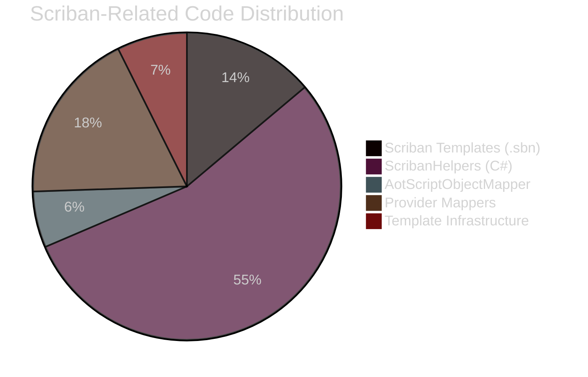

The pie chart above shows the fundamental imbalance: ~1,600 lines of template syntax require ~10,000 lines of C# infrastructure. With user-customizable templates no longer required, this overhead provides no user-facing value.

### 2.2 Constraints Preserved

| Constraint | How It's Maintained |
|------------|---------------------|
| **.NET 10 / C# 13** | No change |
| **NativeAOT** | Simplified (no trimmer workarounds) |
| **No external APIs** | No change (tool remains offline) |
| **Pure DI (ADR-006)** | No change (`CompositionRoot` pattern retained) |
| **Architecture boundaries (ADR-007)** | Strengthened (compile-time enforcement replaces runtime string matching) |
| **Security by default** | Simplified (sensitivity masking on C# models instead of `ScriptObject` trees) |
| **Zero third-party dependencies** | Achieved (Scriban was the sole dependency) |

---

## 3. System Overview

### 3.1 High-Level Architecture

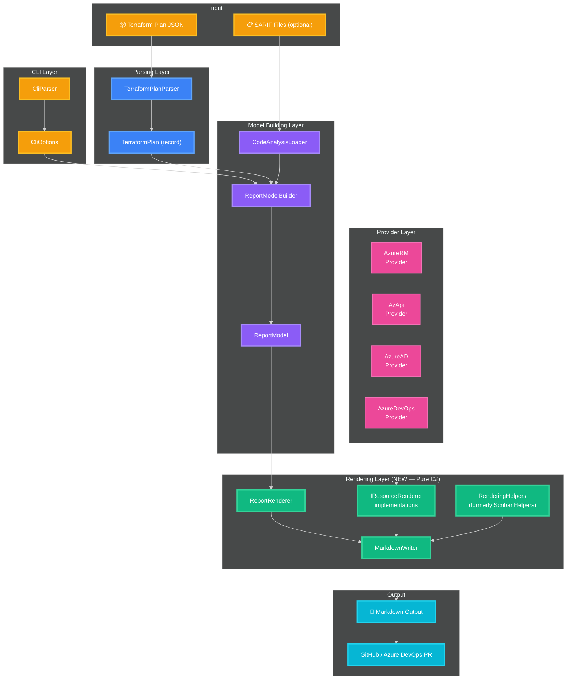

### 3.2 Layer Dependencies

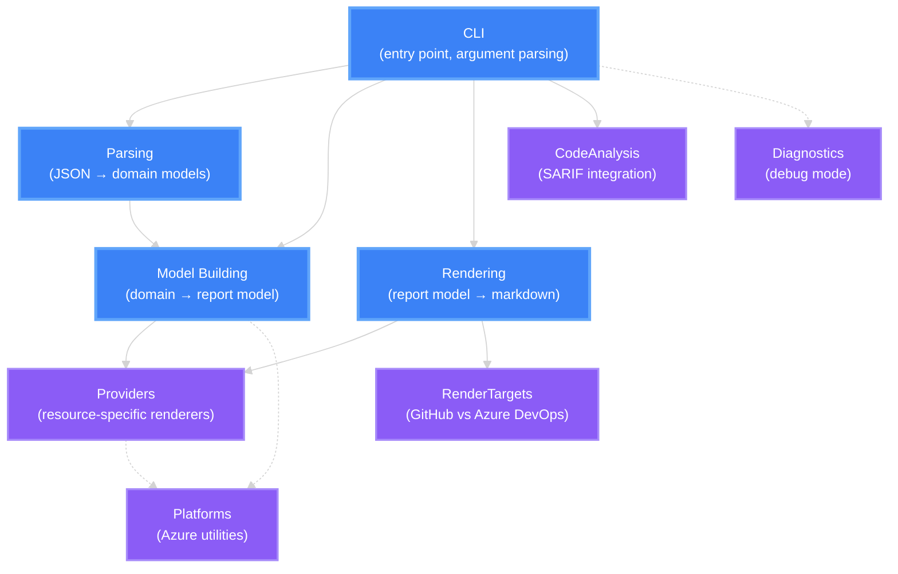

**Key dependency rule:** Providers depend on Rendering interfaces (e.g., `IResourceRenderer`), but the Rendering layer does NOT depend on specific Providers. This inversion enables modular provider registration.

---

## 4. Component Architecture

### 4.1 Directory Structure (Target State)

```
src/Oocx.TfPlan2Md/
├── CLI/                              # Unchanged
│   ├── CliParser.cs
│   ├── CliOptions.cs
│   └── HelpTextProvider.cs
│
├── Parsing/                          # Unchanged
│   ├── TerraformPlanParser.cs
│   ├── TerraformPlan.cs
│   └── TfPlanJsonContext.cs
│
├── MarkdownGeneration/               # RESTRUCTURED
│   ├── ReportModel.cs                # Unchanged
│   ├── ResourceChangeModel.cs        # Unchanged
│   ├── AttributeChangeModel.cs       # Unchanged
│   ├── SummaryModel.cs               # Unchanged
│   ├── ModuleChangeGroup.cs          # Unchanged
│   ├── OutputChangeModel.cs          # Unchanged
│   │
│   ├── ReportModelBuilder.cs         # Unchanged (partial class, 6 files)
│   ├── ReportModelBuilder.Build.cs
│   ├── ReportModelBuilder.ResourceChanges.cs
│   ├── ReportModelBuilder.CodeAnalysis.cs
│   ├── ReportModelBuilder.Summaries.cs
│   ├── ReportModelBuilder.ParentChildMerging.cs
│   ├── ReportModelBuilder.Outputs.cs
│   │
│   ├── Rendering/                    # NEW — Pure C# rendering
│   │   ├── MarkdownWriter.cs         # Fluent markdown construction
│   │   ├── ReportRenderer.cs         # Full report orchestrator
│   │   ├── SummaryRenderer.cs        # Summary table rendering
│   │   ├── HeaderRenderer.cs         # Report header/metadata
│   │   ├── DefaultResourceRenderer.cs # Fallback resource renderer
│   │   ├── ChildResourceRenderer.cs  # Child resource tables
│   │   ├── CodeAnalysisRenderer.cs   # Code analysis sections
│   │   ├── RefactoringRenderer.cs    # Import/move operations
│   │   ├── OutputRenderer.cs         # Terraform outputs
│   │   ├── IResourceRenderer.cs      # Provider extension point
│   │   └── ResourceRendererRegistry.cs # Renderer dispatch
│   │
│   ├── Helpers/                      # RENAMED from ScribanHelpers
│   │   ├── RenderingHelpers/         # Renamed from ScribanHelpers/
│   │   │   ├── DiffFormatting.cs     # Unchanged logic
│   │   │   ├── DiffComputation.cs    # Unchanged logic
│   │   │   ├── LargeValues.cs        # Unchanged logic
│   │   │   ├── ValueFormatting.cs    # Unchanged logic
│   │   │   ├── SemanticFormatting.cs  # Unchanged logic
│   │   │   ├── Markdown.cs           # Unchanged logic
│   │   │   └── ...                   # All other helper files
│   │   ├── JsonFlattener.cs          # Unchanged
│   │   └── ResourceSummaryHtmlBuilder.cs  # Unchanged
│   │
│   ├── Models/                       # Mostly unchanged
│   │   ├── IResourceViewModelFactory.cs   # Unchanged
│   │   ├── ParentChildRelationship.cs     # Unchanged
│   │   └── ...
│   │
│   ├── Summaries/                    # Unchanged
│   │   ├── ResourceSummaryBuilder.cs
│   │   └── ...
│   │
│   ├── Services/                     # SIMPLIFIED
│   │   ├── ProviderRegistry.cs       # Simplified (no RegisterAllHelpers)
│   │   ├── ValueFormatterRegistry.cs # Unchanged
│   │   ├── IconProviderRegistry.cs   # Unchanged
│   │   ├── ResourceRendererRegistry.cs # NEW — replaces template dispatch
│   │   └── ...
│   │
│   ├── REMOVED: TemplateLoader.cs
│   ├── REMOVED: TemplateResolver.cs
│   ├── REMOVED: AotScriptObjectMapper.cs
│   ├── REMOVED: ScribanHelperException.cs
│   └── REMOVED: Templates/            # All .sbn files removed
│
├── Providers/                        # SIMPLIFIED
│   ├── IProviderModule.cs            # Simplified interface
│   ├── AzureRM/
│   │   ├── AzureRMModule.cs          # No RegisterHelpers(ScriptObject)
│   │   ├── Renderers/                # NEW — C# renderers replace .sbn templates
│   │   │   ├── RoleAssignmentRenderer.cs
│   │   │   ├── FirewallNetworkRuleRenderer.cs
│   │   │   ├── FirewallAppRuleRenderer.cs
│   │   │   └── NsgRenderer.cs
│   │   ├── Models/                   # SIMPLIFIED (no ScriptObject mappers)
│   │   ├── RowExtractors/            # Unchanged
│   │   ├── Formatters/               # Unchanged
│   │   ├── Registration/             # Unchanged
│   │   └── REMOVED: Templates/       # .sbn files removed
│   ├── AzApi/
│   │   ├── AzApiModule.cs
│   │   ├── Renderers/                # NEW
│   │   │   └── AzApiResourceRenderer.cs
│   │   └── REMOVED: Templates/
│   ├── AzureAD/
│   │   ├── AzureADModule.cs
│   │   ├── Renderers/                # NEW
│   │   │   ├── UserRenderer.cs
│   │   │   ├── GroupRenderer.cs
│   │   │   ├── GroupMemberRenderer.cs
│   │   │   ├── ServicePrincipalRenderer.cs
│   │   │   └── InvitationRenderer.cs
│   │   └── REMOVED: Templates/
│   └── AzureDevOps/
│       ├── AzureDevOpsModule.cs
│       ├── Renderers/                # NEW
│       │   └── VariableGroupRenderer.cs
│       └── REMOVED: Templates/
│
├── RenderTargets/                    # Unchanged
│   ├── IDiffFormatter.cs
│   ├── GitHub/
│   └── AzureDevOps/
│
├── Platforms/                        # SIMPLIFIED
│   └── Azure/
│       ├── IPrincipalMapper.cs       # Unchanged
│       ├── AzureScopeParser.cs       # Unchanged
│       └── REMOVED: ScribanHelpers.Azure.cs  # Merged into RenderingHelpers
│
├── CompositionRoot.cs                # Simplified (no template loader creation)
├── Program.cs                        # Unchanged
├── ProgramEntry.cs                   # Simplified (no template path handling)
├── Oocx.TfPlan2Md.csproj            # No PackageReference entries
└── REMOVED: TrimmerRootDescriptor.xml  # No longer needed
```

### 4.2 Component Responsibility Matrix

```mermaid
%%{init: {'theme':'dark', 'themeVariables': { 'fontSize':'14px', 'fontFamily':'ui-sans-serif, system-ui, sans-serif'}}}%%
block-beta
    columns 3
    
    block:CLI["CLI"]:1
        CliParser
        CliOptions
        HelpText
    end
    
    block:Parse["Parsing"]:1
        TFParser["TerraformPlanParser"]
        TFPlan["TerraformPlan"]
        JsonCtx["TfPlanJsonContext"]
    end
    
    block:Analysis["CodeAnalysis"]:1
        SarifParser
        CodeLoader["CodeAnalysisLoader"]
        ResMapper["ResourceMapper"]
    end
    
    block:Model["Model Building"]:1
        ReportBuilder["ReportModelBuilder\n(6 partial files)"]
        SummaryBuilder["ResourceSummaryBuilder"]
        space
    end
    
    block:Render["Rendering (NEW)"]:1
        MarkdownWriter
        ReportRenderer
        RendererRegistry["ResourceRendererRegistry"]
    end
    
    block:Providers2["Providers"]:1
        IProviderModule
        IResourceRenderer
        Implementations["4 Provider Modules\n+ Renderers"]
    end

    style CLI fill:#f59e0b,stroke:#fbbf24,color:#ffffff
    style Parse fill:#3b82f6,stroke:#60a5fa,color:#ffffff
    style Analysis fill:#ef4444,stroke:#f87171,color:#ffffff
    style Model fill:#8b5cf6,stroke:#a78bfa,color:#ffffff
    style Render fill:#10b981,stroke:#34d399,color:#ffffff
    style Providers2 fill:#ec4899,stroke:#f472b6,color:#ffffff
```

---

## 5. Rendering Pipeline

### 5.1 Core Interfaces

The rendering layer introduces three key abstractions:

#### `MarkdownWriter` — Fluent Markdown Builder

```csharp
internal sealed class MarkdownWriter
{
    // Structural methods
    MarkdownWriter Heading(int level, string text);
    MarkdownWriter Paragraph(string text);
    MarkdownWriter BlankLine();

    // Table methods
    MarkdownWriter TableHeader(params string[] columns);
    MarkdownWriter TableRow(params string[] cells);

    // HTML methods (for GitHub/Azure DevOps compatibility)
    MarkdownWriter DetailsOpen(string summary, bool open = false);
    MarkdownWriter DetailsClose();

    // Content methods
    MarkdownWriter Code(string text);
    MarkdownWriter InlineCode(string text);
    MarkdownWriter Raw(string markdown);

    // Output
    string Build();
}
```

#### `IResourceRenderer` — Provider Extension Point

```csharp
internal interface IResourceRenderer
{
    // The Terraform resource types this renderer handles
    IReadOnlyList<string> SupportedResourceTypes { get; }

    // Render a resource change to markdown
    void Render(ResourceChangeModel change, MarkdownWriter writer, RenderContext context);
}
```

#### `RenderContext` — Shared Rendering State

```csharp
internal sealed record RenderContext(
    RenderTarget RenderTarget,
    IDiffFormatter DiffFormatter,
    ValueFormatterRegistry ValueFormatters,
    IconProviderRegistry IconProviders,
    IPrincipalMapper PrincipalMapper,
    DetailsDisplayMode DetailsDisplayMode,
    bool ShowSensitive,
    bool ShowUnchangedValues);
```

### 5.2 Rendering Pipeline Flow

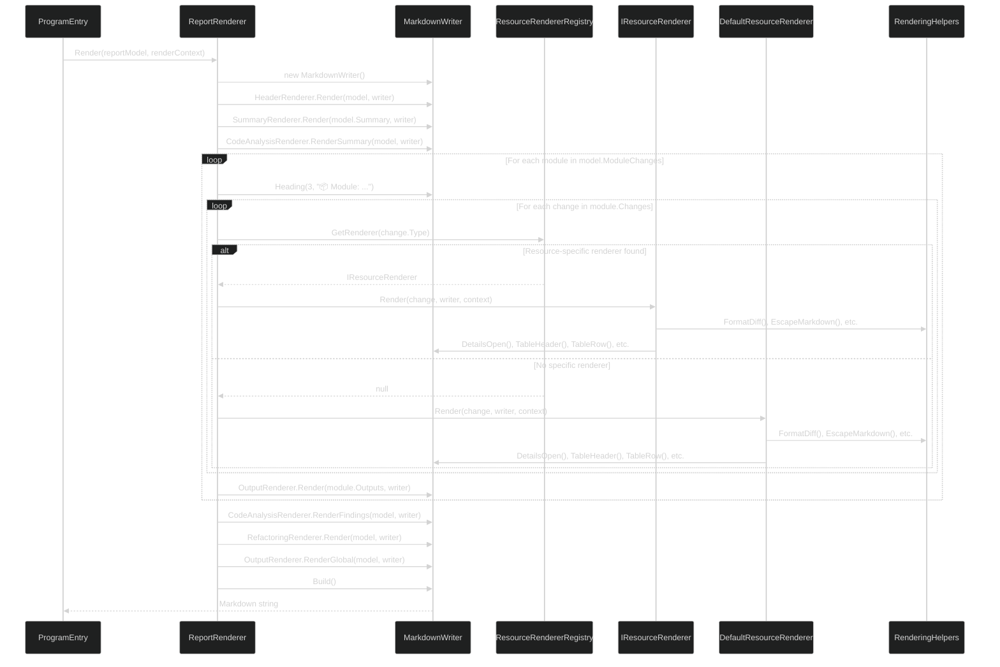

### 5.3 Resource Renderer Dispatch

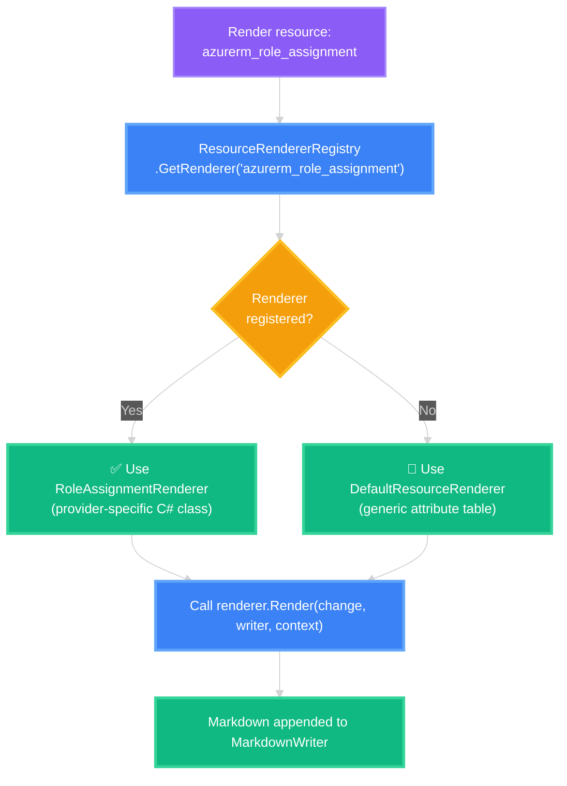

**Comparison with current template resolution:**

| Aspect | Scriban (Current) | Pure C# (Target) |
|--------|-------------------|-------------------|
| Dispatch key | String-based file path (`azurerm/role_assignment.sbn`) | Type-based registry lookup by resource type |
| Fallback | `_resource.sbn` (embedded resource) | `DefaultResourceRenderer` (compiled code) |
| Error on typo | Silent empty output at runtime | Compile error or explicit `null` return |
| New renderer | Create `.sbn` file + `ScriptObject` mapper | Implement `IResourceRenderer` |
| IDE support | None (string-based) | Full (Go to Definition, Find References) |

### 5.4 MarkdownWriter Normalization

The `MarkdownWriter` applies the same output normalization currently done by `MarkdownRenderer`:

```mermaid
%%{init: {'theme':'dark', 'themeVariables': { 'fontSize':'14px', 'fontFamily':'ui-sans-serif, system-ui, sans-serif'}}}%%
flowchart LR
    classDef processNode fill:#3b82f6,stroke:#60a5fa,stroke-width:3px,color:#ffffff
    classDef dataNode fill:#8b5cf6,stroke:#a78bfa,stroke-width:2px,color:#ffffff

    Raw["Raw markdown\nfrom renderers"]
    N1["Remove blank lines\nbetween table rows"]
    N2["Remove indentation\nfrom table rows"]
    N3["Collapse multiple\nblank lines"]
    N4["Ensure blank line\nbefore headings"]
    N5["Ensure blank line\nafter headings"]
    Final["Normalized\nmarkdown output"]

    Raw --> N1 --> N2 --> N3 --> N4 --> N5 --> Final

    class Raw,Final dataNode
    class N1,N2,N3,N4,N5 processNode
```

These normalizations use the same 5 compiled `Regex` instances currently in `MarkdownRenderer.cs`, ensuring identical output.

---

## 6. Provider Architecture

### 6.1 Simplified Provider Module Interface

The `IProviderModule` interface is simplified by removing Scriban-specific methods:

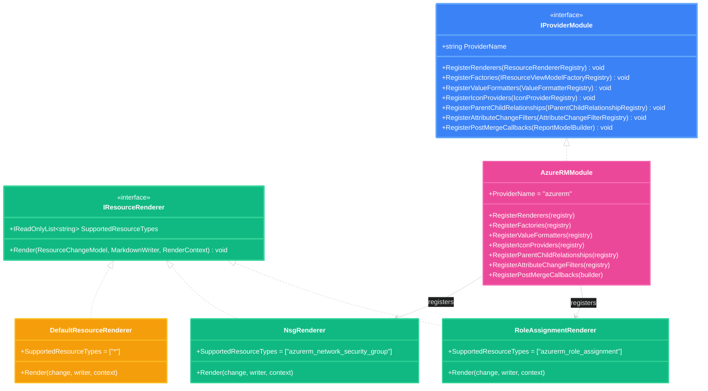

**Removed methods (Scriban-specific):**
- ~~`RegisterHelpers(ScriptObject)`~~ — No more Scriban helper registration
- ~~`string TemplateResourcePrefix`~~ — No more embedded `.sbn` templates
- ~~`RegisterResourceModelMappers(ResourceModelMapperRegistry)`~~ — No more `ScriptObject` enrichment

**New method:**
- `RegisterRenderers(ResourceRendererRegistry)` — Register typed C# renderers

### 6.2 Provider Module Comparison

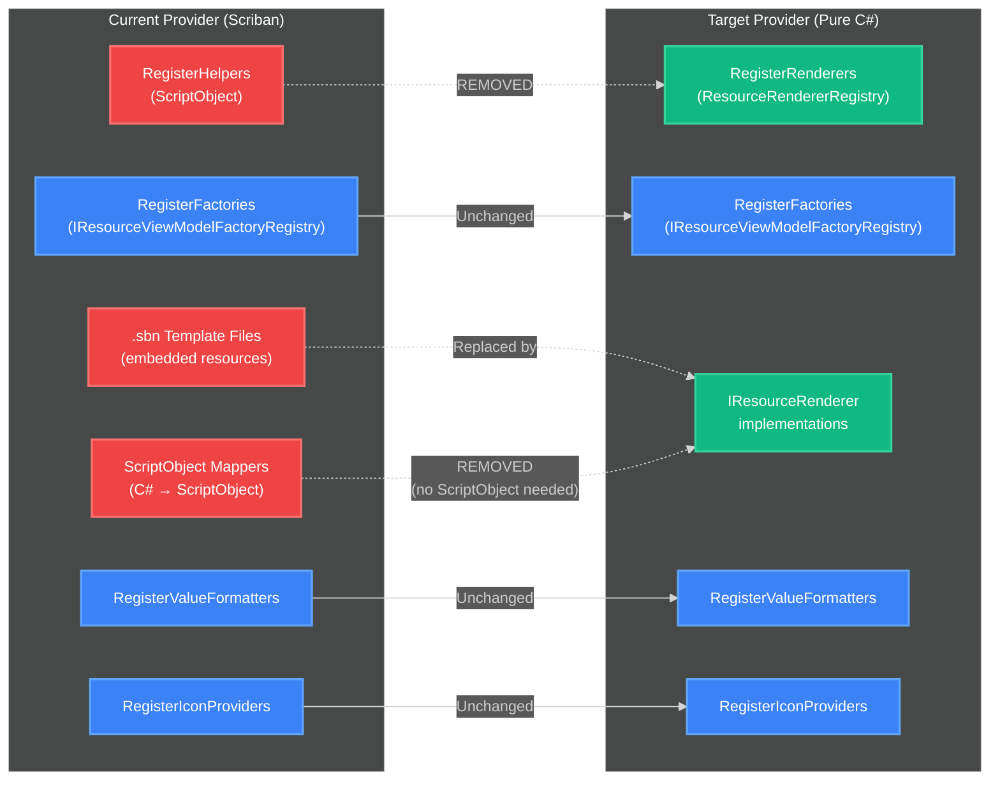

### 6.3 All Provider Renderers

| Provider | Resource Type | Renderer Class | Currently in Template |
|----------|--------------|----------------|----------------------|
| **AzureRM** | `azurerm_role_assignment` | `RoleAssignmentRenderer` | `role_assignment.sbn` |
| **AzureRM** | `azurerm_network_security_group` | `NsgRenderer` | `network_security_group.sbn` |
| **AzureRM** | `azurerm_firewall_network_rule_collection` | `FirewallNetworkRuleRenderer` | `firewall_network_rule_collection.sbn` |
| **AzureRM** | `azurerm_firewall_application_rule_collection` | `FirewallAppRuleRenderer` | `firewall_application_rule_collection.sbn` |
| **AzApi** | `azapi_resource`, `azapi_update_resource` | `AzApiResourceRenderer` | `resource.sbn` |
| **AzureAD** | `azuread_user` | `UserRenderer` | `user.sbn` |
| **AzureAD** | `azuread_group` | `GroupRenderer` | `group.sbn` |
| **AzureAD** | `azuread_group_member` | `GroupMemberRenderer` | `group_member.sbn` |
| **AzureAD** | `azuread_service_principal` | `ServicePrincipalRenderer` | `service_principal.sbn` |
| **AzureAD** | `azuread_invitation` | `InvitationRenderer` | `invitation.sbn` |
| **AzureDevOps** | `azuredevops_variable_group` | `VariableGroupRenderer` | `variable_group.sbn` |
| **Core** | _(all others)_ | `DefaultResourceRenderer` | `_resource.sbn` |

---

## 7. Service Registry Architecture

### 7.1 Registry Landscape

```mermaid
%%{init: {'theme':'dark', 'themeVariables': { 'fontSize':'14px', 'fontFamily':'ui-sans-serif, system-ui, sans-serif'}}}%%
classDiagram
    class PatternMatchingRegistry~T~ {
        +Register(pattern, service)
        +Resolve(resourceType) T?
    }

    class ValueFormatterRegistry {
        +Register(pattern, formatter)
        +Format(name, value, resourceType) string
    }

    class IconProviderRegistry {
        +Register(pattern, provider)
        +GetIcon(name, value, resourceType) string?
    }

    class ResourceRendererRegistry {
        <<NEW>>
        +Register(resourceType, renderer)
        +GetRenderer(resourceType) IResourceRenderer?
    }

    class AttributeChangeFilterRegistry {
        +Register(pattern, filter)
        +ShouldFilter(context) bool
    }

    class ParentChildRelationshipRegistry {
        +Register(relationship)
        +GetRelationship(parentType, childType) ParentChildRelationship?
    }

    PatternMatchingRegistry~T~ <|-- ValueFormatterRegistry : extends
    PatternMatchingRegistry~T~ <|-- IconProviderRegistry : extends
    PatternMatchingRegistry~T~ <|-- ResourceRendererRegistry : extends

    note for ResourceRendererRegistry "NEW: Replaces template-based\ndispatch (TemplateResolver)"

    style PatternMatchingRegistry~T~ fill:#3b82f6,stroke:#60a5fa,stroke-width:3px,color:#ffffff
    style ValueFormatterRegistry fill:#10b981,stroke:#34d399,stroke-width:2px,color:#ffffff
    style IconProviderRegistry fill:#10b981,stroke:#34d399,stroke-width:2px,color:#ffffff
    style ResourceRendererRegistry fill:#f59e0b,stroke:#fbbf24,stroke-width:3px,color:#ffffff
    style AttributeChangeFilterRegistry fill:#10b981,stroke:#34d399,stroke-width:2px,color:#ffffff
    style ParentChildRelationshipRegistry fill:#10b981,stroke:#34d399,stroke-width:2px,color:#ffffff
```

### 7.2 Resource Renderer Registration Flow

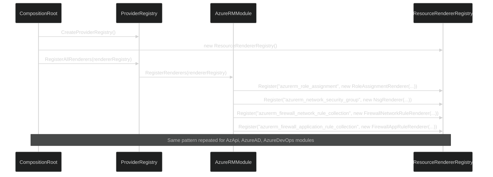

---

## 8. Data Flow

### 8.1 End-to-End Data Flow

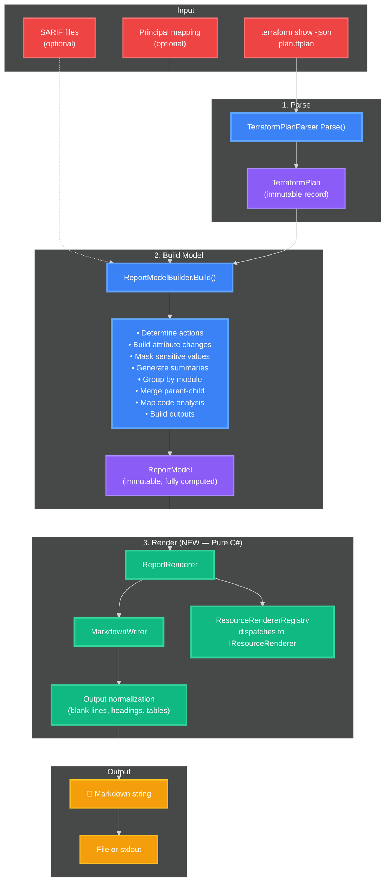

### 8.2 Data Model (Unchanged)

The `ReportModel` and its component types remain unchanged. The key difference is that renderers consume these types directly via C# property access instead of through `ScriptObject` wrappers:

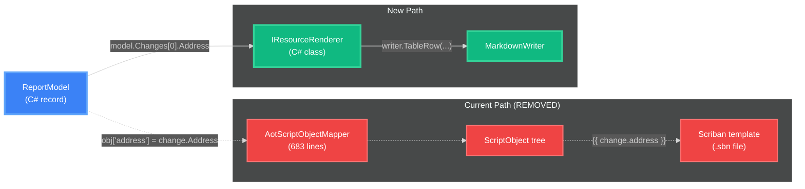

### 8.3 Sensitivity Handling (Simplified)

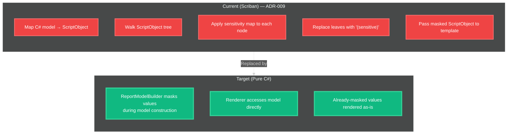

In the target architecture, sensitivity masking happens in `ReportModelBuilder` during model construction (the `AttributeChangeModel.Before`/`After` values are already masked). There is no need for a separate masking pass on intermediate data structures.

---

## 9. Composition and Dependency Injection

### 9.1 Simplified Composition Root

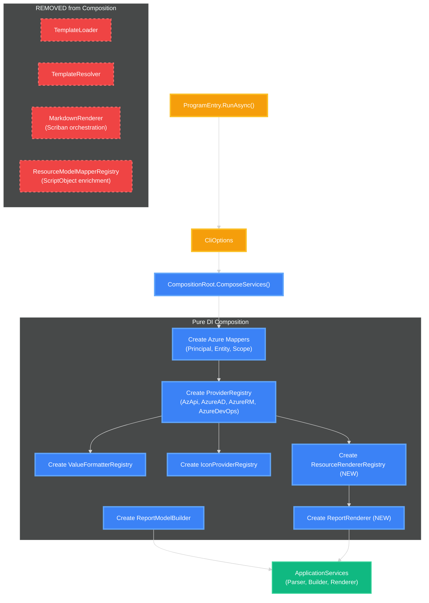

### 9.2 ApplicationServices Record (Simplified)

```csharp
// Current
internal sealed record ApplicationServices(
    TerraformPlanParser Parser,
    ReportModelBuilder ModelBuilder,
    MarkdownRenderer Renderer,           // Scriban-based
    DiagnosticContext? DiagnosticContext,
    CodeAnalysisInput? CodeAnalysisInput);

// Target
internal sealed record ApplicationServices(
    TerraformPlanParser Parser,
    ReportModelBuilder ModelBuilder,
    ReportRenderer Renderer,             // Pure C# — no Scriban
    DiagnosticContext? DiagnosticContext,
    CodeAnalysisInput? CodeAnalysisInput);
```

---

## 10. Error Handling

### 10.1 Exception Hierarchy (Simplified)

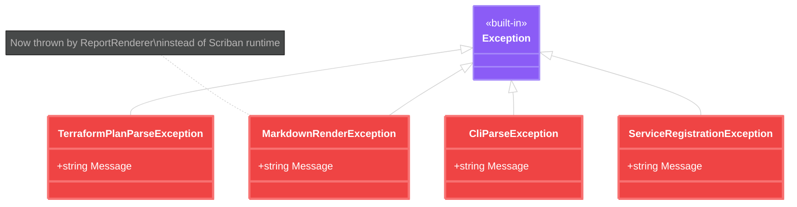

**Removed:** `ScribanHelperException` — No longer needed since helper function errors are now regular C# exceptions caught by the rendering pipeline.

**Key improvement:** Template-related runtime errors (missing variables, type mismatches) are eliminated entirely because all rendering is compile-time verified C# code.

---

## 11. Cross-Cutting Concerns

### 11.1 Security

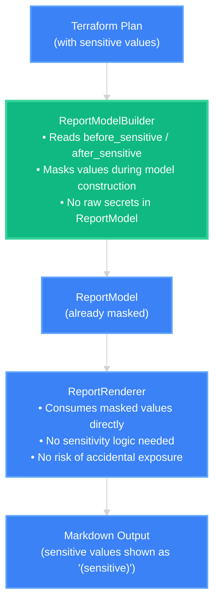

**Improvement over current architecture:**

| Concern | Scriban (Current) | Pure C# (Target) |
|---------|-------------------|-------------------|
| Masking location | `AotScriptObjectMapper` (at template boundary) | `ReportModelBuilder` (during model construction) |
| Risk of bypass | Templates can access raw `before_json`/`after_json` | No raw JSON exposed — model values are pre-masked |
| Masking complexity | Recursive `ScriptObject`/`ScriptArray` tree walk | Simple string replacement on model properties |
| ADR-009 overhead | Required recursive masking on dynamic types | Eliminated |

### 11.2 Testing Strategy

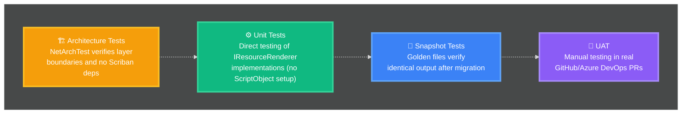

**Testing simplification:**
- **No more `ScriptObject` construction in tests** — Test renderers by calling `renderer.Render(model, writer, context)` directly
- **Snapshot tests are the migration oracle** — Existing golden files must produce identical output
- **Architecture tests verify Scriban removal** — New rule: no assembly may reference `Scriban`

### 11.3 NativeAOT Impact

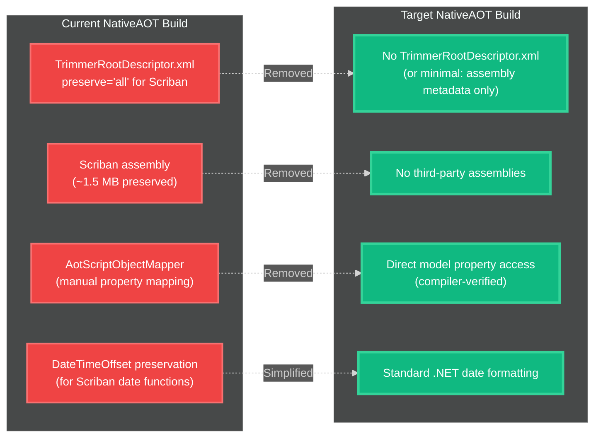

**Estimated binary size reduction:** ~1.5 MB (Scriban assembly) + ~0.3 MB (trimmer-preserved metadata) = **~1.8 MB smaller NativeAOT binary**.

---

## 12. Migration Impact Analysis

### 12.1 Files Affected

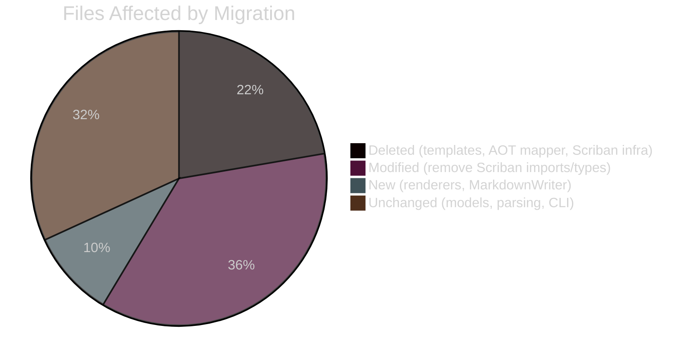

### 12.2 Migration Phases

```mermaid
%%{init: {'theme':'dark', 'themeVariables': { 'fontSize':'14px', 'fontFamily':'ui-sans-serif, system-ui, sans-serif'}}}%%
gantt
    title Migration Phases
    dateFormat X
    axisFormat %s

    section Phase 1: Framework
    Create MarkdownWriter                    :a1, 0, 2
    Create IResourceRenderer                 :a2, 0, 1
    Create ResourceRendererRegistry          :a3, 1, 2
    Create DefaultResourceRenderer           :a4, 2, 4
    Create RenderContext                     :a5, 1, 2
    Rename ScribanHelpers → RenderingHelpers :a6, 2, 4

    section Phase 2: Core Templates
    Convert _header.sbn → HeaderRenderer     :b1, 4, 5
    Convert _summary.sbn → SummaryRenderer   :b2, 4, 5
    Convert _resource.sbn → DefaultResourceRenderer :b3, 4, 6
    Convert _child_resources.sbn → ChildResourceRenderer :b4, 5, 7
    Convert default.sbn → ReportRenderer     :b5, 6, 8
    Convert code_analysis partials           :b6, 6, 8
    Remove AotScriptObjectMapper             :b7, 8, 9
    Validate against snapshot tests          :crit, b8, 8, 9

    section Phase 3: Provider Templates
    Convert azurerm/ templates               :c1, 9, 11
    Convert azuread/ templates               :c2, 9, 11
    Convert azapi/ templates                 :c3, 10, 12
    Convert azuredevops/ templates           :c4, 10, 12
    Simplify IProviderModule interface       :c5, 12, 13
    Validate against snapshot tests          :crit, c6, 12, 13

    section Phase 4: Cleanup
    Remove Scriban PackageReference          :d1, 13, 14
    Remove TrimmerRootDescriptor entries     :d2, 13, 14
    Update architecture docs                :d3, 14, 15
    Update ADR statuses                     :d4, 14, 15
    Final snapshot test validation           :crit, d5, 15, 16
```

### 12.3 Lines of Code Impact

| Category | Added | Removed | Net |
|----------|------:|--------:|----:|
| `MarkdownWriter` + `RenderContext` | ~200 | 0 | +200 |
| `ReportRenderer` (replaces `MarkdownRenderer`) | ~300 | ~542 | -242 |
| `DefaultResourceRenderer` (replaces `_resource.sbn`) | ~150 | ~100 | +50 |
| Provider-specific renderers (replace `.sbn` templates) | ~800 | ~1,500 | -700 |
| `ResourceRendererRegistry` (replaces `TemplateResolver`) | ~50 | ~264 | -214 |
| `AotScriptObjectMapper` removal | 0 | ~683 | -683 |
| `ScribanHelperException` removal | 0 | ~30 | -30 |
| Provider `ScriptObject` mappers removal | 0 | ~2,099 | -2,099 |
| Helper registration code removal (`Registry.cs`) | 0 | ~65 | -65 |
| `TrimmerRootDescriptor.xml` simplification | 0 | ~12 | -12 |
| Test file updates | ~500 | ~2,000 | -1,500 |
| **Total estimated** | **~2,000** | **~7,295** | **~-5,295** |

**Net reduction: ~5,300 lines of code removed.**

---

## 13. Quality Attributes

### 13.1 Comparison Matrix

| Quality Attribute | Scriban (Current) | Pure C# (Target) | Change |
|-------------------|-------------------|-------------------|--------|
| **Compile-time safety** | ❌ Template variable typos are silent | ✅ All property access verified | ⬆️ Better |
| **Binary size** | ~7 MB (NativeAOT) | ~5.2 MB (estimated) | ⬆️ Smaller |
| **Startup time** | < 1 sec | < 1 sec (slightly faster) | ➡️ Same |
| **Third-party deps** | 1 (Scriban) | 0 | ⬆️ Better |
| **IDE support** | ❌ Template variables are opaque strings | ✅ Full Go to Definition, Find References | ⬆️ Better |
| **Rendering performance** | Good (Scriban interprets templates) | Better (compiled C# methods) | ⬆️ Better |
| **Layout readability** | ✅ `.sbn` files visually represent output | ⚠️ C# `StringBuilder` is less visual | ⬇️ Slightly worse |
| **Extension complexity** | Medium (create `.sbn` + mapper) | Low (implement `IResourceRenderer`) | ⬆️ Better |
| **Test setup** | Complex (`ScriptObject` construction) | Simple (call method with model) | ⬆️ Better |
| **Security surface** | Templates can access raw state | Renderers only see masked model | ⬆️ Better |

### 13.2 Architecture Boundary Enforcement

```mermaid
%%{init: {'theme':'dark', 'themeVariables': { 'fontSize':'14px', 'fontFamily':'ui-sans-serif, system-ui, sans-serif'}}}%%
flowchart TD
    classDef allowed fill:#10b981,stroke:#34d399,stroke-width:2px,color:#ffffff
    classDef forbidden fill:#ef4444,stroke:#f87171,stroke-width:2px,color:#ffffff

    subgraph Rules["Architecture Test Rules (NetArchTest)"]
        R1["✅ Providers → Rendering interfaces\n(IResourceRenderer, MarkdownWriter)"]
        R2["✅ Rendering → RenderTargets\n(IDiffFormatter)"]
        R3["✅ Providers → Platforms\n(Azure utilities)"]
        R4["❌ Rendering → Providers\n(no direct dependency)"]
        R5["❌ Parsing → Rendering\n(no direct dependency)"]
        R6["❌ Any assembly → Scriban\n(NEW: zero tolerance)"]
    end

    class R1,R2,R3 allowed
    class R4,R5,R6 forbidden
```

The architecture test suite should add a new rule:

```csharp
// No assembly may reference Scriban after migration
Types.InAssembly(assembly)
    .ShouldNot()
    .HaveDependencyOn("Scriban")
    .GetResult()
    .IsSuccessful
    .Should().BeTrue();
```

---

## 14. Glossary

| Term | Definition |
|------|------------|
| **MarkdownWriter** | New fluent API for constructing well-formed Markdown output in C# |
| **IResourceRenderer** | Interface implemented by provider-specific renderers for Terraform resource types |
| **ResourceRendererRegistry** | Registry that maps Terraform resource types to `IResourceRenderer` implementations |
| **DefaultResourceRenderer** | Fallback renderer for resource types without a provider-specific renderer |
| **RenderContext** | Immutable record carrying shared rendering state (diff formatter, registries, options) |
| **ReportRenderer** | Top-level orchestrator that renders a complete `ReportModel` to Markdown |
| **RenderingHelpers** | Renamed from `ScribanHelpers`; static utility methods for formatting, escaping, and diff computation |
| **NativeAOT** | .NET ahead-of-time compilation producing self-contained native binary |
| **Pure DI** | Dependency injection without a container; services wired explicitly in `CompositionRoot` |
| **Snapshot Tests** | Golden file tests that verify markdown output matches expected baseline |

---

## Appendix A: References

- [ADR-010: Evaluate Removing Scriban](adr-010-scriban-removal-evaluation.md) — Decision record for this architecture change
- [ADR-001: Use Scriban for Markdown Templating](adr-001-scriban-templating.md) — Original decision (superseded by ADR-010)
- [ADR-005: Scriban Template Loop Limit](adr-005-scriban-template-loop-limit.md) — Superseded by removal
- [ADR-006: Pure Dependency Injection](adr-006-dependency-injection.md) — Retained in target architecture
- [ADR-007: Architecture Boundary Enforcement](adr-007-architecture-boundary-enforcement.md) — Strengthened in target architecture
- [ADR-009: Template JSON Sensitivity Masking](adr-009-template-json-sensitivity-masking.md) — Simplified in target architecture
- [Current Architecture](architecture.md) — Existing arc42 documentation (Scriban-based)
