# tfplan2md Architecture (arc42)

**About arc42:** This document follows the [arc42](https://arc42.org/) architecture documentation template. Arc42 provides a clear structure for documenting software architecture, making it easier to understand, maintain, and communicate technical decisions.

**License:** The arc42 template is licensed under a [Creative Commons Attribution-ShareAlike 4.0 International License](https://creativecommons.org/licenses/by-sa/4.0/). This documentation is derived from the arc42 template and is shared under the same license.

---

## 1. Introduction and Goals

### 1.1 Requirements Overview

tfplan2md is a CLI tool that converts Terraform plan JSON files into human-readable Markdown reports. The tool addresses a critical pain point in DevOps workflows: reviewing infrastructure changes in pull requests.

**Primary Target Environment:** GitHub Pull Request comments and Azure DevOps Pull Request comments. All markdown output must render correctly in both platforms.

**Key Requirements:**
- Parse Terraform plan JSON (`terraform show -json` output)
- Generate clean, readable Markdown reports compatible with GitHub and Azure DevOps
- Support customizable templates via Scriban
- Handle sensitive values securely (masking by default)
- Group resources by module with proper hierarchy
- Provide semantic diffs for complex resources (firewall rules, NSG rules)
- Run in Docker containers for CI/CD integration
- Minimal attack surface and image size

### 1.2 Quality Goals

| Priority | Quality Goal | Motivation |
|----------|--------------|------------|
| 1 | **Security** | Mask sensitive values by default; use distroless images; minimal dependencies |
| 2 | **Reliability** | Handle malformed JSON gracefully; validate all markdown output |
| 3 | **Usability** | Simple CLI; sensible defaults; clear error messages |
| 4 | **Maintainability** | Clean architecture; comprehensive tests; modern C# patterns |
| 5 | **Extensibility** | Template system for customization; resource-specific renderers; plugin-ready architecture |
| 6 | **Performance** | Fast startup time for CI/CD pipelines; handle large plans efficiently |

### 1.3 Stakeholders

| Role | Expectations |
|------|--------------|
| **DevOps Engineers** | Easy integration with CI/CD pipelines; reliable markdown rendering in GitHub and Azure DevOps PR comments |
| **Infrastructure Teams** | Clear visibility of Terraform changes in PR reviews; semantic diffs for complex resources |
| **Security Reviewers** | Sensitive values masked; audit trail of infrastructure changes visible in PRs |
| **Project Maintainer** | Modern codebase; comprehensive testing; AI-assisted development workflow |

---

## 2. Architecture Constraints

### 2.1 Technical Constraints

| Constraint | Background |
|------------|------------|
| **.NET 10** | Latest LTS framework for long-term support and modern C# features |
| **C# 13** | Modern language features (records, pattern matching, file-scoped namespaces) |
| **Docker Distribution** | Primary distribution mechanism; must run in distroless containers |
| **Scriban Templates** | Template engine for markdown generation (ADR-001) |
| **System.Text.Json** | Built-in JSON parser for .NET 10 |
| **No External APIs** | Tool must work offline without external dependencies |

### 2.2 Organizational Constraints

| Constraint | Background |
|------------|------------|
| **100% AI-Assisted Development** | All code generated with GitHub Copilot using multi-model approach |
| **Conventional Commits** | Automated versioning with Versionize requires strict commit message format |
| **Open Source (MIT)** | Public repository; community contributions welcome |
| **Multi-Agent Workflow** | Feature development follows Requirements Engineer → Architect → Quality Engineer → Developer → Release Manager flow |

### 2.3 Conventions

| Convention | Background |
|------------|------------|
| **Semantic Versioning** | MAJOR.MINOR.PATCH versioning with Conventional Commits |
| **Markdown Quality** | All output validated with markdownlint-cli2; must be compatible with GitHub and Azure DevOps PR comments |
| **Code Style** | Enforced via .editorconfig and dotnet format; see docs/commenting-guidelines.md for comprehensive style guide |
| **XML Documentation** | All members must have XML doc comments (including private members) |
| **Target Platforms** | GitHub Pull Request comments and Azure DevOps Pull Request comments are the primary rendering targets |

---

## 3. System Scope and Context

### 3.1 Business Context

```mermaid
%%{init: {'theme':'dark', 'themeVariables': { 'fontSize':'16px', 'fontFamily':'ui-sans-serif, system-ui, sans-serif'}}}%%
flowchart TD
    classDef userNode fill:#f59e0b,stroke:#fbbf24,stroke-width:3px,color:#ffffff
    classDef systemNode fill:#3b82f6,stroke:#60a5fa,stroke-width:3px,color:#ffffff
    classDef destNode fill:#10b981,stroke:#34d399,stroke-width:3px,color:#ffffff
    
    User[👤 DevOps Engineer<br/>User]
    CLI[tfplan2md CLI<br/><br/>• Parse Terraform JSON<br/>• Build Report Model<br/>• Render Markdown<br/>• Apply Templates]
    Dest[📝 GitHub / Azure DevOps PR<br/>Destination]
    
    User -->|terraform show -json plan.tfplan| CLI
    CLI -->|markdown report| Dest
    
    class User userNode
    class CLI systemNode
    class Dest destNode
```



**External Interfaces:**

| Interface | Description |
|-----------|-------------|
| **Input: Terraform Plan JSON** | Standard Terraform plan format from `terraform show -json` |
| **Output: Markdown Report** | Markdown optimized for GitHub and Azure DevOps PR comments; includes tables, collapsible sections, emoji |
| **Templates: Scriban Files** | User-provided custom templates or built-in defaults |
| **Principal Mapping: JSON** | Optional Azure principal ID to name mapping file |

### 3.2 Technical Context

**Deployment Context:**

```mermaid
%%{init: {'theme':'dark', 'themeVariables': { 'fontSize':'16px', 'fontFamily':'ui-sans-serif, system-ui, sans-serif'}}}%%
flowchart LR
    classDef pipelineNode fill:#8b5cf6,stroke:#a78bfa,stroke-width:3px,color:#ffffff
    
    TF["📦 Terraform Plan<br/>(in CI/CD Pipeline)"]
    Docker["🐳 oocx/tfplan2md<br/>Docker Container"]
    Output["📝 PR Comment / File<br/>(GitHub / Azure DevOps)"]
    
    TF -->|JSON| Docker
    Docker -->|Markdown| Output
    
    class TF,Docker,Output pipelineNode
```



**Technology Mapping:**

| Component | Technology | Version | Purpose |
|-----------|-----------|---------|---------|
| **Runtime** | .NET Runtime | 10.0 | Execute compiled application |
| **Language** | C# | 13 | Implementation language |
| **JSON Parser** | System.Text.Json | Built-in | Parse Terraform plan JSON |
| **Template Engine** | Scriban | 6.5.2 | Render markdown from templates |
| **Container Base** | mcr.microsoft.com/dotnet/runtime:10.0-noble-chiseled | - | Distroless runtime image (~50MB) |
| **Test Framework** | xUnit | 2.9.3 | Unit and integration tests |
| **Assertion Library** | AwesomeAssertions | Latest | Fluent test assertions |
| **Linter** | markdownlint-cli2 | 0.20.0 | Validate markdown output |

---

## 4. Solution Strategy

### 4.1 Technology Decisions

| Decision | Rationale | ADR Reference |
|----------|-----------|---------------|
| **Scriban for templating** | Lightweight, text-focused, familiar syntax, embeddable | ADR-001 |
| **Chiseled Docker image** | Minimal attack surface (~50MB), no shell, security-first | ADR-002 |
| **Modern C# 13 patterns** | Records for immutability, file-scoped namespaces, nullable reference types | ADR-003 |

### 4.2 Key Architectural Patterns

**Separation of Concerns:**
- **Parsing** → Parse JSON into domain models
- **Model Building** → Transform domain models into report models
- **Rendering** → Apply templates to generate markdown
- **CLI** → Handle user interaction and orchestration

**Immutability:**
- All data models are immutable records
- No mutable shared state
- Pure functions for transformations

**Template-Driven Rendering:**
- Default templates embedded as resources
- Custom templates loaded from filesystem
- Resource-specific templates override defaults
- Templates keep logic minimal; complex logic provided by model and helper functions

**Extensibility First:**
- Users can create custom templates for any resource type
- Resource-specific templates in `{provider}/{resource}.sbn` format
- Future: customizable icons, summary formatters, and other extensibility points

**Security by Default:**
- Sensitive values masked unless `--show-sensitive` flag provided
- Minimal Docker image with no shell access
- No external network calls

### 4.3 Top-Level Decomposition

```
tfplan2md/
├── CLI/                         # Command-line parsing and orchestration
│   ├── CliParser.cs             # Argument parsing
│   └── HelpTextProvider.cs      # Usage documentation
│
├── Parsing/                     # Terraform plan JSON parsing
│   ├── TerraformPlan.cs         # Domain models (records)
│   ├── TerraformPlanParser.cs
│   └── TerraformPlanParseException.cs
│
├── MarkdownGeneration/          # Core report model building and rendering
│   ├── ReportModel.cs           # Report data models
│   ├── MarkdownRenderer.cs      # Template application and orchestration
│   ├── ReportModelBuilder.cs    # Transform domain models to report models
│   ├── Models/                  # Core model interfaces and registries
│   │   ├── IResourceViewModelFactory.cs
│   │   └── ResourceViewModelFactoryRegistry.cs
│   ├── Summaries/               # Resource summary builders
│   ├── Helpers/                 # Core Scriban helper functions
│   │   ├── ScribanHelpers.*.cs  # Grouped by concern (DiffFormatting, Markdown, etc.)
│   │   └── ScribanTemplateLoader.cs  # Multi-prefix template loading
│   └── Templates/               # Core embedded Scriban templates
│       ├── default.sbn          # Global report template
│       ├── summary.sbn          # Summary-only template
│       └── _resource.sbn        # Default per-resource fallback template
│
├── Providers/                   # Provider-specific implementations (modular)
│   ├── IProviderModule.cs       # Provider registration contract
│   ├── ProviderRegistry.cs      # Explicit provider registration
│   ├── AzApi/                   # AzApi provider (azapi_resource, azapi_update_resource)
│   │   ├── AzApiModule.cs       # Provider registration
│   │   ├── Helpers/             # AzApi-specific Scriban helpers
│   │   └── Templates/           # AzApi-specific .sbn templates
│   ├── AzureRM/                 # AzureRM provider (azurerm_*)
│   │   ├── AzureRMModule.cs     # Provider registration
│   │   ├── Models/              # AzureRM-specific view models and factories
│   │   │   ├── FirewallNetworkRuleCollectionViewModelFactory.cs
│   │   │   ├── NetworkSecurityGroupViewModelFactory.cs
│   │   │   └── RoleAssignmentViewModelFactory.cs
│   │   ├── Helpers/             # AzureRM-specific Scriban helpers
│   │   └── Templates/           # AzureRM-specific .sbn templates (NSG, firewall, etc.)
│   └── AzureDevOps/             # AzureDevOps provider (azuredevops_*)
│       ├── AzureDevOpsModule.cs # Provider registration
│       ├── Models/              # AzureDevOps-specific view models
│       └── Templates/           # AzureDevOps-specific .sbn templates
│
├── RenderTargets/               # Platform-specific rendering (GitHub vs Azure DevOps)
│   ├── IDiffFormatter.cs        # Diff formatting abstraction
│   ├── GitHubDiffFormatter.cs   # Simple diff format for GitHub PR comments
│   └── AzureDevOpsDiffFormatter.cs  # Inline diff format for Azure DevOps PR comments
│
├── Platforms/                   # Cloud platform utilities (Azure-specific, provider-agnostic)
│   └── Azure/
│       ├── PrincipalMapper.cs   # Map Azure principal IDs to names
│       └── RoleNamesProvider.cs # Azure role name constants
│
└── Program.cs                   # Application entry point
```

**Key Architectural Changes (Feature 047):**
- **Provider Separation:** All Terraform provider-specific code (azapi, azurerm, azuredevops) now lives in dedicated `Providers/` folders with explicit registration via `IProviderModule`.
- **RenderTarget Separation:** Platform-specific rendering logic (GitHub vs Azure DevOps) moved to `RenderTargets/` with `IDiffFormatter` abstraction.
- **Template Multi-Prefix Loading:** `ScribanTemplateLoader` checks core templates first, then provider-specific templates, enabling modular template organization.
- **Explicit Registration:** No reflection-based discovery; all providers register explicitly through `ProviderRegistry`.

---

## 5. Building Block View

### 5.1 Level 1: System Overview


### 5.2 Level 2: Component Details

#### 5.2.1 CLI Component

**Purpose:** Handle command-line interface interactions and orchestrate the conversion process.

**Responsibilities:**
- Parse command-line arguments
- Read input (stdin or file)
- Invoke parsing and rendering components
- Write output (stdout or file)
- Handle errors with user-friendly messages

**Key Classes:**
- `CliParser` - Parses arguments into `CliOptions`
- `HelpTextProvider` - Provides usage documentation
- `CliOptions` (record) - Parsed command-line options
- `CliParseException` - Exception for invalid arguments

#### 5.2.2 Parsing Component

**Purpose:** Parse Terraform plan JSON into strongly-typed domain models.

**Responsibilities:**
- Deserialize JSON using `System.Text.Json`
- Validate plan structure
- Extract resource changes, actions, attributes
- Handle before/after state, sensitive values, replace paths

**Key Classes:**
- `TerraformPlanParser` - Main parser
- `TerraformPlan` (record) - Root plan model
- `ResourceChange` (record) - Individual resource change
- `Change` (record) - Before/after/actions for a resource
- `ReplacePathsConverter` - Custom JSON converter for replace paths
- `TerraformPlanParseException` - Exception for parse errors

**Data Flow:**


#### 5.2.3 MarkdownGeneration Component

**Purpose:** Transform parsed plans into markdown reports using templates.

**Responsibilities:**
- Build report models from domain models
- Apply Scriban templates (default, summary, resource-specific)
- Handle sensitive value masking
- Generate summaries and statistics
- Format attributes for readability
- Resolve and apply resource-specific templates

**Key Classes:**

| Class | Responsibility |
|-------|---------------|
| `ReportModelBuilder` | Transform `TerraformPlan` → `ReportModel`; build rich model data to keep template logic minimal |
| `ReportModel` | Data passed to templates (terraform version, changes, summary, module groups) |
| `ResourceChangeModel` | Single resource change for template rendering; includes precomputed summaries and formatted values |
| `AttributeChangeModel` | Single attribute change |
| `SummaryModel` | Aggregated statistics (count by action, breakdown by type) |
| `MarkdownRenderer` | Apply templates to generate markdown; validate output is compatible with GitHub and Azure DevOps |
| `ScribanHelpers` | Custom Scriban functions (`diff_array`, `format_diff`, etc.); provides complex logic that templates should not implement |
| `LargeValueFormat` (enum) | Display mode for large values (inline-diff, simple-diff) |
| `IResourceSummaryBuilder` / `ResourceSummaryBuilder` | Generate one-line summaries for resources |

**Design Principle: Logic in Code, Not Templates**

Scriban templates must remain simple and declarative. All complex logic (conditional formatting, data transformations, calculations) is implemented in C# and provided to templates through:
- Rich model properties (precomputed values)
- Helper functions registered with Scriban
- Model builders that prepare data for rendering

This ensures templates are maintainable and extensible by users without C# knowledge.

**Subdirectories:**

| Directory | Purpose |
|-----------|---------|
| `Summaries/` | Resource summary generation logic |
| `Templates/` | Embedded Scriban templates (default.sbn for report structure, _resource.sbn for default resource rendering, summary.sbn, azurerm/* for resource-specific overrides) |

**Template Resolution Flow:**
1. If custom template directory provided: `{customDir}/{provider}/{resource}.sbn`
2. Else, embedded resource-specific: `Templates/{provider}/{resource}.sbn`
3. Else, default resource template: `Templates/_resource.sbn`

**Data Flow:**



```mermaid
%%{init: {'theme':'dark', 'themeVariables': { 'fontSize':'16px', 'fontFamily':'ui-sans-serif, system-ui, sans-serif'}}}%%
flowchart TD
    classDef dataNode fill:#8b5cf6,stroke:#a78bfa,stroke-width:2px,color:#ffffff
    classDef processNode fill:#3b82f6,stroke:#60a5fa,stroke-width:3px,color:#ffffff
    
    Plan[TerraformPlan]
    Builder[ReportModelBuilder.Build]
    Model[ReportModel]
    Renderer[MarkdownRenderer.Render]
    Templates[📄 Scriban templates<br/>.sbn files]
    Output[Markdown string]
    
    Plan --> Builder
    Builder --> Model
    Model --> Renderer
    Templates --> Renderer
    Renderer --> Output
    
    class Plan,Model,Templates,Output dataNode
    class Builder,Renderer processNode
```

#### 5.2.3.1 Report Model Structure

The `ReportModel` is the central data structure passed to templates. It contains all the data needed to render a complete Terraform plan report, organized hierarchically.

**Model Class Diagram:**


**Model Components:**

| Model Class | Purpose | Template Access |
|-------------|---------|-----------------|
| `ReportModel` | Root container for all report data | Direct properties: `terraform_version`, `summary`, `module_changes`, etc. |
| `ModuleChangeGroup` | Groups resources by Terraform module | Iterate via `module_changes`, access `module_address` and `changes` |
| `SummaryModel` | Aggregated statistics for the summary table | Access via `summary.to_add.count`, `summary.total`, etc. |
| `ActionSummary` | Per-action statistics with type breakdown | `count` for total, `breakdown` for per-type counts |
| `ResourceTypeBreakdown` | Count of resources per type for an action | `type` (resource type name), `count` (number) |
| `ResourceChangeModel` | Single resource with all change details | Full resource data including `before_json`/`after_json` for raw state |
| `AttributeChangeModel` | Single attribute's before/after values | `name`, `before`, `after`, `is_sensitive`, `is_large` |

**Precomputed Properties:**

To keep templates simple, several properties are precomputed by `ReportModelBuilder`:

| Property | Computed From | Purpose |
|----------|---------------|---------|
| `ActionSymbol` | `Action` | Emoji symbol (➕, 🔄, ❌, ♻️) for the action |
| `Summary` | Resource state | One-line human-readable summary (e.g., "`example-rg` in `westeurope`") |
| `SummaryHtml` | Multiple fields | Rich HTML for `<summary>` elements with formatted values |
| `ChangedAttributesSummary` | `AttributeChanges` | Compact list of changed attributes (e.g., "2🔧 tags, location") |
| `TagsBadges` | Resource tags | Formatted tag badges for create/delete actions |

**Data Flow from Terraform Plan to Model:**


#### 5.2.4 Providers Component

**Purpose:** Encapsulate Terraform provider-specific logic (templates, helpers, view models) in dedicated modules.

**Responsibilities:**
- Register provider-specific Scriban helpers
- Register provider-specific resource view model factories
- Provide embedded templates for provider-specific resources
- Keep provider-specific concerns isolated and modular

**Architecture:**

Each provider is a self-contained module implementing the `IProviderModule` interface:

```csharp
public interface IProviderModule
{
    string Name { get; }
    void RegisterHelpers(Scriban.TemplateContext context);
    void RegisterFactories(IResourceViewModelFactoryRegistry registry);
}
```

**Provider Registration:**

Providers are explicitly registered in `ProviderRegistry` at application startup (no reflection):

```csharp
ProviderRegistry.RegisterProviders(
    new AzApiModule(),
    new AzureRMModule(),
    new AzureDevOpsModule()
);
```

**Current Providers:**

| Provider | Namespace | Resources | Key Features |
|----------|-----------|-----------|--------------|
| **AzApi** | `Oocx.TfPlan2Md.Providers.AzApi` | `azapi_resource`, `azapi_update_resource` | Templates for Azure API resources, AzApi-specific helpers |
| **AzureRM** | `Oocx.TfPlan2Md.Providers.AzureRM` | `azurerm_*` (firewall, NSG, role assignments, etc.) | Resource-specific view models, semantic diffs for complex resources |
| **AzureDevOps** | `Oocx.TfPlan2Md.Providers.AzureDevOps` | `azuredevops_variable_group` | Variable group templates and view models |

**Provider Structure (Example: AzureRM):**

```
Providers/AzureRM/
├── AzureRMModule.cs          # IProviderModule implementation
├── Models/                   # View models and factories
│   ├── FirewallNetworkRuleCollectionViewModelFactory.cs
│   ├── NetworkSecurityGroupViewModelFactory.cs
│   └── RoleAssignmentViewModelFactory.cs
├── Helpers/                  # AzureRM-specific Scriban helpers
│   └── ScribanHelpers.AzureRM.*.cs
└── Templates/                # .sbn templates for azurerm_* resources
    ├── azurerm_network_security_group.sbn
    ├── azurerm_firewall_network_rule_collection.sbn
    └── azurerm_role_assignment.sbn
```

**Template Multi-Prefix Loading:**

The `ScribanTemplateLoader` searches for templates in multiple locations:
1. Core templates: `MarkdownGeneration.Templates.*`
2. Provider templates: `Providers.{Provider}.Templates.*`

This enables modular template organization without breaking the fallback to `_resource.sbn`.

**Adding a New Provider:**

See [src/Oocx.TfPlan2Md/Providers/README.md](../../src/Oocx.TfPlan2Md/Providers/README.md) for guidance on adding new providers.

---

#### 5.2.5 RenderTargets Component

**Purpose:** Platform-specific rendering logic for GitHub vs Azure DevOps PR comments.

**Responsibilities:**
- Format diffs according to platform markdown capabilities
- Provide platform-specific formatting (simple diff for GitHub, inline diff for Azure DevOps)
- Abstract platform differences from core rendering logic

**Architecture:**

The `IDiffFormatter` interface abstracts platform-specific diff formatting:

```csharp
public interface IDiffFormatter
{
    string FormatDiff(string before, string after);
}
```

**Current Implementations:**

| Implementation | Target Platform | Diff Format |
|----------------|-----------------|-------------|
| `GitHubDiffFormatter` | GitHub PR comments | **Simple Diff**: Separate before/after blocks with `-` and `+` prefixes |
| `AzureDevOpsDiffFormatter` | Azure DevOps PR comments | **Inline Diff**: Strikethrough for before, green for after in single line |

**CLI Integration:**

Users select the render target via `--render-target` flag:

```bash
tfplan2md plan.json --render-target github      # Use simple diff format
tfplan2md plan.json --render-target azuredevops # Use inline diff format (alias: azdo)
```

The selected `IDiffFormatter` is injected into `ScribanHelpers` and used by templates via the `diff` helper function.

**Design Rationale:**

GitHub and Azure DevOps have different markdown rendering capabilities:
- **GitHub**: No strikethrough support in code blocks → use separate before/after blocks
- **Azure DevOps**: Full HTML support in markdown → use inline strikethrough for compact diffs

See [ADR-005: RenderTarget Abstraction](adr-005-render-target-abstraction.md) for details (if created).

---

#### 5.2.6 Platform Utilities Component

**Purpose:** Cloud platform utilities (Azure-specific, provider-agnostic).

**Responsibilities:**
- Map Azure principal IDs to human-readable names
- Provide Azure role name constants
- Format Azure resource IDs for readability

**Key Classes:**
- `PrincipalMapper` - Load and resolve principal ID mappings from JSON file
- `RoleNamesProvider` - Azure role name constants

**Note:** This component is Azure-specific but not Terraform provider-specific. It's used by both AzApi and AzureRM providers.

---

## 6. Runtime View

### 6.1 Standard Execution Flow


### 6.2 Template Resolution Sequence

```mermaid
%%{init: {'theme':'dark', 'themeVariables': { 'fontSize':'16px', 'fontFamily':'ui-sans-serif, system-ui, sans-serif'}}}%%
flowchart TD
    classDef startNode fill:#8b5cf6,stroke:#a78bfa,stroke-width:2px,color:#ffffff
    classDef processNode fill:#3b82f6,stroke:#60a5fa,stroke-width:3px,color:#ffffff
    classDef decisionNode fill:#f59e0b,stroke:#fbbf24,stroke-width:3px,color:#ffffff
    classDef endNode fill:#10b981,stroke:#34d399,stroke-width:3px,color:#ffffff
    
    Start[Render resource:<br/>azurerm_firewall_network_rule_collection]
    Extract[Extract provider and resource name<br/>provider: azurerm<br/>resource: firewall_network_rule_collection]
    CheckCustom{Custom template<br/>directory provided?}
    LoadCustom[Load from custom<br/>{custom}/{provider}/{resource}.sbn]
    CheckEmbedded[Check embedded resource:<br/>Templates/{provider}/{resource}.sbn]
    FoundCustom{Found?}
    FoundEmbedded{Found?}
    ApplySpecific[✅ Apply resource-specific template]
    ApplyDefault[📄 Fallback to _resource.sbn template]
    
    Start --> Extract
    Extract --> CheckCustom
    CheckCustom -->|Yes| LoadCustom
    CheckCustom -->|No| CheckEmbedded
    LoadCustom --> FoundCustom
    CheckEmbedded --> FoundEmbedded
    FoundCustom -->|Yes| ApplySpecific
    FoundCustom -->|No| CheckEmbedded
    FoundEmbedded -->|Yes| ApplySpecific
    FoundEmbedded -->|No| ApplyDefault
    
    class Start startNode
    class Extract,LoadCustom,CheckEmbedded processNode
    class CheckCustom,FoundCustom,FoundEmbedded decisionNode
    class ApplySpecific,ApplyDefault endNode
```

### 6.3 Error Handling Flow


---

## 7. Deployment View

### 7.1 Docker Deployment

**Multi-Stage Build:**

```mermaid
%%{init: {'theme':'dark', 'themeVariables': { 'fontSize':'16px', 'fontFamily':'ui-sans-serif, system-ui, sans-serif'}}}%%
flowchart TD
    classDef buildNode fill:#3b82f6,stroke:#60a5fa,stroke-width:2px,color:#ffffff
    classDef runtimeNode fill:#10b981,stroke:#34d399,stroke-width:2px,color:#ffffff
    
    subgraph Build["🔨 Build Stage (mcr.microsoft.com/dotnet/sdk:10.0)"]
        B1[1. Copy source files]
        B2[2. dotnet restore]
        B3[3. dotnet build -c Release]
        B4[4. dotnet test -c Release]
        B5[5. dotnet publish -c Release -o /app]
        
        B1 --> B2 --> B3 --> B4 --> B5
    end
    
    subgraph Runtime["🐳 Runtime Stage (mcr.microsoft.com/dotnet/runtime:10.0-noble-chiseled)"]
        R1[🔒 Security Features:<br/>• No shell, no package manager<br/>• Non-root user<br/>• ~50MB total size<br/>• Includes /examples/comprehensive-demo]
        R2[▶️ ENTRYPOINT: dotnet tfplan2md.dll]
        
        R1 --> R2
    end
    
    B5 -->|📦 Copy /app| Runtime
    
    class B1,B2,B3,B4,B5 buildNode
    class R1,R2 runtimeNode
```



**Usage Patterns:**

| Pattern | Command |
|---------|---------|
| **From stdin** | `terraform show -json plan.tfplan \| docker run -i oocx/tfplan2md` |
| **From file** | `docker run -v $(pwd):/data oocx/tfplan2md /data/plan.json` |
| **With output file** | `docker run -i -v $(pwd):/data oocx/tfplan2md --output /data/plan.md < plan.json` |
| **Custom template** | `docker run -v $(pwd):/data oocx/tfplan2md --template /data/my-template.sbn /data/plan.json` |

### 7.2 CI/CD Integration

**GitHub Actions Example:**

```yaml
- name: Generate Terraform Plan Report
  run: |
    terraform show -json plan.tfplan | \
      docker run -i oocx/tfplan2md --output plan.md
    
- name: Post to PR
  uses: actions/github-script@v6
  with:
    script: |
      const fs = require('fs');
      const markdown = fs.readFileSync('plan.md', 'utf8');
      github.rest.issues.createComment({
        issue_number: context.issue.number,
        owner: context.repo.owner,
        repo: context.repo.repo,
        body: markdown
      });
```

**Azure DevOps Example:**

```yaml
- task: Docker@2
  displayName: 'Generate Plan Report'
  inputs:
    command: run
    arguments: '-i -v $(Pipeline.Workspace):/data oocx/tfplan2md /data/plan.json --output /data/plan.md'

- task: PublishPipelineArtifact@1
  inputs:
    targetPath: '$(Pipeline.Workspace)/plan.md'
    artifact: 'terraform-plan-report'
```

### 7.3 Distribution Channels

| Channel | Artifact | Tag Strategy |
|---------|----------|-------------|
| **Docker Hub** | `oocx/tfplan2md` | `latest`, `v1`, `v1.2`, `v1.2.3` |
| **GitHub Container Registry** | `ghcr.io/oocx/tfplan2md` | Same as Docker Hub |
| **GitHub Releases** | Source code, changelog | `v1.2.3` |

---

## 8. Cross-Cutting Concepts

### 8.1 Security

**Sensitive Value Handling:**
- Default behavior: mask all sensitive values as `(sensitive)`
- Opt-in via `--show-sensitive` flag
- Sensitivity determined by Terraform's `before_sensitive` and `after_sensitive` flags
- Masking applied after comparison (to detect actual changes)

**Container Security:**
- Distroless base image (no shell, no package manager)
- Non-root user execution
- Minimal dependencies (only .NET runtime and Scriban)
- No network calls required
- Regular Dependabot updates for vulnerabilities

### 8.2 Testing Strategy

**Test Pyramid:**

```mermaid
%%{init: {'theme':'dark', 'themeVariables': { 'fontSize':'16px', 'fontFamily':'ui-sans-serif, system-ui, sans-serif'}}}%%
graph TB
    subgraph " "
        UAT["🧪 UAT<br/><br/>Manual testing in real<br/>GitHub/Azure DevOps PRs"]
        Snapshot["📸 Snapshot/Fuzz<br/><br/>Golden file tests for markdown output"]
        Integration["🔗 Integration<br/><br/>Docker tests, markdown lint validation"]
        Unit["⚙️ Unit<br/><br/>Parsing, rendering, CLI, helpers"]
    end
    
    Unit -.-> Integration
    Integration -.-> Snapshot
    Snapshot -.-> UAT
    
    classDef uatStyle fill:#8b5cf6,stroke:#a78bfa,stroke-width:3px,color:#ffffff
    classDef snapshotStyle fill:#3b82f6,stroke:#60a5fa,stroke-width:3px,color:#ffffff
    classDef integrationStyle fill:#10b981,stroke:#34d399,stroke-width:3px,color:#ffffff
    classDef unitStyle fill:#06b6d4,stroke:#22d3ee,stroke-width:3px,color:#ffffff
    
    class UAT uatStyle
    class Snapshot snapshotStyle
    class Integration integrationStyle
    class Unit unitStyle
```



**Test Categories:**

| Category | Framework | Purpose |
|----------|-----------|---------|
| **Unit Tests** | xUnit | Test individual components in isolation |
| **Integration Tests** | xUnit + Docker | Test Docker container end-to-end |
| **Snapshot Tests** | xUnit + Golden files | Detect unexpected markdown changes |
| **Invariant Tests** | xUnit + Markdig | Verify markdown always follows rules |
| **Fuzz Tests** | xUnit + Theory | Test with random/edge-case inputs |
| **Lint Tests** | markdownlint-cli2 in Docker | Validate markdown quality |
| **UAT** | Manual in GitHub/Azure DevOps PRs | Validate real-world rendering |

**Quality Gates:**
- All tests must pass before merge
- Markdown output must pass `markdownlint-cli2`
- Code format must pass `dotnet format --verify-no-changes`
- Pre-commit hooks enforce format and build

### 8.3 Markdown Quality

**Validation Layers:**

1. **Generation Time:**
   - Escape special characters in table cells (pipes, newlines)
   - Convert newlines to `<br/>` tags
   - Balance HTML tags (`<details>`, `<summary>`)
   - Proper heading hierarchy (H1 for title, H2 for sections, H3 for modules, H4 for resources)
   - Ensure compatibility with both GitHub and Azure DevOps markdown renderers

2. **Test Time:**
   - Parse all tables with Markdig
   - Verify no consecutive blank lines (MD012)
   - Verify no blank lines between table rows
   - Verify no raw newlines in table cells
   - Snapshot tests detect unexpected changes

3. **CI Time:**
   - Run `markdownlint-cli2` on comprehensive demo output
   - Fail build if markdown is invalid

4. **UAT Time:**
   - Post markdown to real GitHub and Azure DevOps PR comments (primary target platforms)
   - Manual review of rendering in both environments
   - Validate compatibility with both platforms' markdown parsers

**Platform-Specific Rendering Adjustments:**

*Azure DevOps Inline Diff Alignment:*

Azure DevOps markdown tables misalign inline code elements with default `display:inline-block` styling. To ensure proper vertical alignment of remove/add diff rows in table cells, inline diffs use block-level code elements:

```html
<code style="display:block; white-space:normal; padding:0; margin:0;">
  <!-- diff content -->
</code>
```

The `WrapInlineDiffCode` helper in `ScribanHelpers.cs` (L863-873) applies this specialized styling, distinct from the standard `WrapInlineCode` used for non-diff values. This ensures character-level highlighting and semantic icons remain visible while maintaining proper cell alignment in both GitHub and Azure DevOps. See `ScribanHelpersFormatDiffTests.cs` test case "FormatDiff_InlineDiff_UsesBlockCodeForAlignment" for verification.

### 8.4 Templating Architecture

The templating system uses Scriban to generate markdown reports. Templates are loaded from embedded resources or custom directories, and resource-specific templates can override the default rendering for specific Terraform resource types.

#### Template Loading

Templates are loaded from two sources in priority order:

1. **Built-in Templates** - Embedded as assembly resources in `Oocx.TfPlan2Md.MarkdownGeneration.Templates.*`
2. **Custom Templates** - Loaded from filesystem when `--template` flag or custom directory is provided

**Built-in Template Resolution:**


#### Template Processing Pipeline

When `Render(model)` is called, the system:

1. **Select appropriate template** - For each resource change:
   - Parse resource type to extract provider and resource name
   - Resolve which template to use (resource-specific or default)
2. **Render directly** - Invoke the selected template to generate markdown for that resource
3. **Normalize output** - Fix heading spacing, collapse multiple blank lines


#### Resource-Specific Template Resolution

Resource types are parsed to extract provider and resource name:
- `azurerm_firewall_network_rule_collection` → provider: `azurerm`, resource: `firewall_network_rule_collection`

Resolution order:
1. **Custom directory**: `{customDir}/{provider}/{resource}.sbn`
2. **Embedded resource**: `Templates/{provider}/{resource}.sbn`
3. **Fallback**: Use default template (`_resource.sbn`)

Each template is invoked directly with the resource change, eliminating the need for post-processing or section replacement.

**Template Hierarchy:**

```
Global Report Templates:
  ├── default.sbn       (Full report structure - header, summary, footer)
  └── summary.sbn       (Compact summary only)

Per-Resource Templates:
  ├── _resource.sbn     (Default fallback for all resources)
  └── azurerm/          (Provider-specific overrides)
      ├── firewall_network_rule_collection.sbn
      ├── network_security_group.sbn
      └── role_assignment.sbn
```

#### Template Context

**Global templates** receive a `ReportModel` with:
- `terraform_version` - Terraform version string
- `format_version` - Plan format version
- `timestamp` - Plan generation timestamp
- `report_title` - Optional custom title
- `summary` - Aggregated statistics
- `changes` - Flat list of resource changes (no-ops filtered out)
- `module_changes` - Changes grouped by module
- `show_unchanged_values` - Boolean flag
- `large_value_format` - Display mode enum

**Resource-specific templates** receive a `ResourceChangeModel` with:
- `address` - Full resource address
- `type` - Resource type (e.g., `azurerm_firewall_network_rule_collection`)
- `name` - Resource name
- `action` - Action (create, update, delete, replace)
- `action_symbol` - Emoji symbol for the action
- `attribute_changes` - List of attribute changes
- `before_json` - Raw JSON state before change (converted to ScriptObject for navigation)
- `after_json` - Raw JSON state after change (converted to ScriptObject for navigation)
- `replace_paths` - Paths that triggered replacement
- `summary` - Precomputed one-line summary

#### Property Name Conversion

All C# property names are converted to snake_case for template access:
- `TerraformVersion` → `terraform_version`
- `ModuleChanges` → `module_changes`
- `BeforeJson` → `before_json`

**Custom Scriban Functions:**

| Function | Signature | Purpose |
|----------|-----------|---------|
| `diff_array` | `diff_array(before, after, key)` | Semantic diff of arrays by key property |
| `format_diff` | `format_diff(before, after)` | Format before/after values with `-`/`+` markers |
| `escape_markdown` | `escape_markdown(value)` | Escape special characters for markdown |
| `format_code_table` | `format_code_table(value)` | Format value as inline code in tables |
| `format_code_summary` | `format_code_summary(value)` | Format value for summary HTML |
| `format_attribute_value_summary` | `format_attribute_value_summary(name, value, provider)` | Format attribute with semantic icons |
| `format_attribute_value_table` | `format_attribute_value_table(name, value, provider)` | Format attribute for table cells |
| `format_large_value` | `format_large_value(before, after, format)` | Render large values with diff highlighting |
| `is_large_value` | `is_large_value(value, provider)` | Check if value exceeds size threshold |
| `azure_role_name` | `azure_role_name(role_id)` | Map Azure role definition ID to name |
| `azure_scope` | `azure_scope(scope_id)` | Parse Azure resource scope to readable format |
| `azure_principal_name` | `azure_principal_name(principal_id)` | Resolve Azure principal ID to name |

**Template Rendering Patterns:**

*Large-Only Resource Rendering:*

Resources containing only large attributes (no small attributes or tags) render their content directly inline without an inner collapsible section. This design decision eliminates unnecessary click friction when all resource content is large-valued. The conditional wrapping logic applies:

```scriban
{{ if small_attrs.size > 0 || change.tags_badges }}
  <br/><details>
    <summary>Large values:</summary>
    <!-- large attribute content -->
  </details>
{{ else }}
  <!-- large attribute content rendered inline -->
{{ end }}
```

This maintains the outer resource-level `<details>` wrapper while avoiding nested collapsible sections when they provide no value. See test cases TC-16 through TC-19 in `MarkdownRendererTemplateFormattingTests.cs` for verification.

### 8.5 Error Handling Strategy

**Exception Hierarchy:**


**Error Handling Principles:**
- Catch specific exceptions at the top level (Program.cs)
- Provide user-friendly error messages (not stack traces)
- Return appropriate exit codes (1 for errors)
- Log errors to stderr
- Never suppress errors silently

**Exit Codes:**

| Code | Meaning |
|------|---------|
| 0 | Success |
| 1 | Error (parse failure, render failure, invalid arguments) |

### 8.6 Immutability Pattern

**All data models are immutable:**
- `TerraformPlan`, `ResourceChange`, `Change` (parsing)
- `ReportModel`, `ResourceChangeModel`, `AttributeChangeModel` (rendering)
- `CliOptions` (CLI)

**Benefits:**
- Thread-safe (no shared mutable state)
- Easier to reason about (no unexpected mutations)
- Simplified testing (predictable inputs/outputs)

**Implementation:**
- Use `record` types with positional parameters
- Use `required init` properties for non-positional records
- Use `IReadOnlyList<T>` and `IReadOnlyDictionary<K,V>` for collections

---

## 9. Architecture Decisions

All significant architecture decisions are documented as ADRs:

| ADR | Title | Status |
|-----|-------|--------|
| [ADR-001](features/000-initial-project-setup/architecture.md#adr-001-use-scriban-for-markdown-templating) | Use Scriban for Markdown Templating | Accepted |
| [ADR-002](features/000-initial-project-setup/architecture.md#adr-002-use-net-chiseled-distroless-docker-image) | Use .NET Chiseled (Distroless) Docker Image | Superseded by Feature 037 |
| [ADR-003](features/000-initial-project-setup/architecture.md#adr-003-use-modern-c-13-patterns) | Use Modern C# 13 Patterns | Accepted |
| [ADR-004](features/000-initial-project-setup/architecture.md#adr-004-use-css-layers-for-example-style-isolation) | Use CSS Layers for Example Style Isolation | Accepted |

---

## 10. Quality Requirements

### 10.1 Performance

| Requirement | Target | Measurement |
|-------------|--------|-------------|
| **Startup time** | < 1 second | Time from invocation to first output |
| **Processing time** | < 5 seconds for 1000 resources | End-to-end conversion time |
| **Memory usage** | < 200MB for 1000 resources | Peak memory during processing |
| **Docker image size** | < 100MB | Total image size on Docker Hub |

### 10.2 Reliability

| Requirement | Target | Measurement |
|-------------|--------|-------------|
| **Parse success rate** | 100% for valid Terraform JSON | Test coverage with diverse plans |
| **Markdown validity** | 100% pass markdownlint-cli2 | CI checks |
| **Error recovery** | Graceful error messages for invalid input | Manual testing |

### 10.3 Security

| Requirement | Implementation |
|-------------|----------------|
| **Sensitive value masking** | Default masking with opt-in `--show-sensitive` |
| **No external network calls** | Tool operates entirely offline |
| **Minimal attack surface** | Distroless container, no shell, no package manager |
| **Dependency scanning** | Dependabot for NuGet, Docker, GitHub Actions |

### 10.4 Maintainability

| Requirement | Implementation |
|-------------|----------------|
| **Code style enforcement** | `.editorconfig`, `dotnet format`, pre-commit hooks; comprehensive style guide in docs/commenting-guidelines.md |
| **Test coverage** | Comprehensive unit, integration, snapshot, fuzz tests |
| **Documentation** | XML doc comments on all members (including private), arc42 architecture doc |
| **Automated versioning** | Conventional Commits + Versionize |

### 10.5 Extensibility

| Requirement | Implementation |
|-------------|----------------|
| **Custom templates** | Users can provide their own Scriban templates via `--template` flag |
| **Resource-specific templates** | Template resolution supports provider-specific overrides (e.g., `azurerm/firewall_network_rule_collection.sbn`) |
| **Simple template logic** | Complex logic implemented in C# (model builders, helpers) to keep templates accessible to non-developers |
| **Future extensibility** | Architecture supports future additions such as custom icon configuration |

---

## 11. Risks and Technical Debt

### 11.1 Known Limitations

| Limitation | Impact | Mitigation |
|------------|--------|------------|
| **No backward compatibility with Terraform < 1.0** | May not parse older plan formats | Document minimum Terraform version |
| **Scriban iteration limit (1000)** | Large plans with many no-ops fail | Filter out no-ops from template context |
| **No plan validation** | Malformed plans may cause cryptic errors | Validate plan structure during parsing |
| **No incremental rendering** | Large plans held in memory | Acceptable for typical plan sizes |

### 11.2 Technical Debt

| Debt Item | Priority | Resolution Plan |
|-----------|----------|----------------|
| **No plugin system for custom renderers** | Low | Architecture supports future plugin system for summary builders and formatters |
| **No caching for repeated template loads** | Low | Optimize if performance issues arise |
| **Limited resource-specific templates** | Medium | Add more provider-specific templates as needed (architecture supports easy addition) |
| **No user-configurable icons** | Low | Planned extensibility feature; architecture prepared for icon configuration |

### 11.3 Future Enhancements

| Enhancement | Priority | Notes |
|-------------|----------|-------|
| **Custom icon configuration** | Medium | Allow users to define custom icons for attributes and actions |

---

## 12. Glossary

| Term | Definition |
|------|------------|
| **Terraform Plan** | A JSON representation of proposed infrastructure changes generated by `terraform plan` |
| **Resource Change** | A single resource creation, update, deletion, or replacement in a Terraform plan |
| **Scriban** | A lightweight text templating engine for .NET |
| **Distroless** | A Docker image containing only the application and runtime dependencies, no OS utilities |
| **Chiseled** | Microsoft's term for distroless .NET images |
| **ADR** | Architecture Decision Record - Documents significant design decisions |
| **arc42** | A template for architecture documentation |
| **UAT** | User Acceptance Testing - Manual validation in real environments |
| **Semantic Diff** | Comparing arrays/lists by content, not by index (e.g., firewall rules) |
| **Sensitive Value** | Terraform attribute marked as sensitive (passwords, secrets) |
| **No-Op** | A resource with no changes (included in plan but not modified) |
| **Module Grouping** | Organizing resources by Terraform module hierarchy |
| **Principal Mapping** | Converting Azure principal IDs to human-readable names |
| **Conventional Commits** | A commit message format for automated versioning |
| **Versionize** | A tool that automates semantic versioning from commit messages |

---

## Appendix A: References

- **arc42 Template:** https://arc42.org/
- **Terraform JSON Plan Format:** https://developer.hashicorp.com/terraform/internals/json-format
- **Scriban Documentation:** https://github.com/scriban/scriban
- **.NET 10 Documentation:** https://learn.microsoft.com/en-us/dotnet/core/whats-new/dotnet-10
- **C# 13 Documentation:** https://learn.microsoft.com/en-us/dotnet/csharp/whats-new/csharp-13
- **Conventional Commits:** https://www.conventionalcommits.org/
- **Semantic Versioning:** https://semver.org/

---

## Appendix B: Document Changelog

| Version | Date | Author | Changes |
|---------|------|--------|---------|
| 1.0 | 2025-12-29 | GitHub Copilot (Claude Sonnet 4.5) | Initial arc42 architecture documentation |
