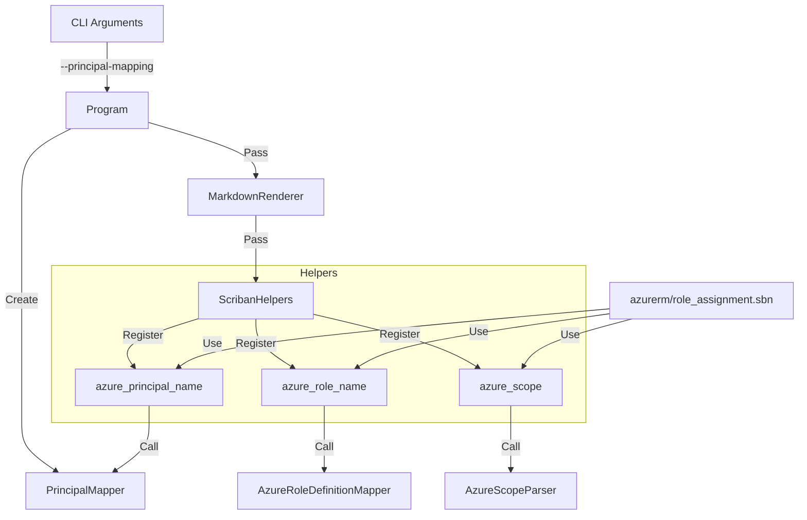

# Architecture: Enhanced Azure Role Assignment Display

## Overview

This document outlines the technical design for improving the readability of `azurerm_role_assignment` resources in the generated markdown reports. The solution involves adding Azure-specific parsing logic, a lookup mechanism for built-in roles, and a user-provided mapping for principals, all integrated via Scriban template helpers.

## Components

### 1. Azure Role Definition Mapper (`AzureRoleDefinitionMapper`)
A static utility class responsible for mapping Azure built-in Role Definition GUIDs to their display names.
- **Data Structure**: A `FrozenDictionary<string, string>` containing the mapping of GUIDs to Role Names (e.g., `acdd72a7...` -> "Reader").
- **Source**: The mapping will be hardcoded based on the official Azure documentation at the time of implementation.
- **Method**: `GetRoleName(string roleDefinitionId)`
  - Extracts the GUID from the full ID string if necessary.
  - Returns "Name (GUID)" if found, otherwise returns the original input.

### 2. Azure Scope Parser (`AzureScopeParser`)
A static utility class responsible for parsing Azure resource IDs (scopes) into human-readable strings.
- **Method**: `ParseScope(string scope)`
- **Logic**:
  - Splits the scope string by `/`.
  - Identifies the scope type (Subscription, Resource Group, Management Group, or specific Resource).
  - Formats the output using Markdown styling (e.g., `**ResourceName** in **ResourceGroup**`).
  - Handles common resource types (Key Vault, Storage, etc.) with simplified type names.

### 3. Principal Mapper (`PrincipalMapper`)
A service class responsible for resolving Principal IDs to display names using a user-provided JSON file.
- **Interface**: `IPrincipalMapper` with method `GetPrincipalName(string principalId)`.
- **Initialization**: Loads a JSON dictionary `Dictionary<string, string>` from a file path specified via CLI args.
- **Behavior**:
  - If the ID exists in the mapping, returns "DisplayName [ID]".
  - If not found or no file provided, returns the original ID.
  - Handles JSON parsing errors gracefully (logs warning, continues without mapping).

## Integration Points

### CLI Options
Update `CliOptions` and `CliParser` to support a new optional argument:
- `--principal-mapping <path>`: Path to the JSON file containing principal ID to name mappings.

### Application Flow
1. **Program.cs**:
   - Parse the new CLI option.
   - Instantiate `PrincipalMapper` with the provided path (or null).
   - Pass the `PrincipalMapper` instance to the `MarkdownRenderer`.

2. **MarkdownRenderer**:
   - Update constructor to accept `IPrincipalMapper`.
   - Pass the mapper to `RenderWithTemplate` and `RenderResourceWithTemplate`.

3. **ScribanHelpers**:
   - Update `RegisterHelpers` to accept `IPrincipalMapper`.
   - Register new custom helper functions that expose the functionality to templates:
     - `azure_role_name`: Calls `AzureRoleDefinitionMapper.GetRoleName`.
     - `azure_scope`: Calls `AzureScopeParser.ParseScope`.
     - `azure_principal_name`: Calls `PrincipalMapper.GetPrincipalName`.

### Templates
Create a new resource-specific template: `src/Oocx.TfPlan2Md/MarkdownGeneration/Templates/azurerm/role_assignment.sbn`.
- This template will override the default rendering for `azurerm_role_assignment`.
- It will use the new helpers to format `role_definition_id`, `scope`, and `principal_id`.

## Data Flow

## Future Considerations
- The `AzureRoleDefinitionMapper` dictionary is static. If Azure adds new built-in roles, the tool needs a recompilation/update. This is acceptable as built-in roles change infrequently.
- Custom role definitions are not supported by the mapper (requires Azure API access), which aligns with the "Out of Scope" requirements.
