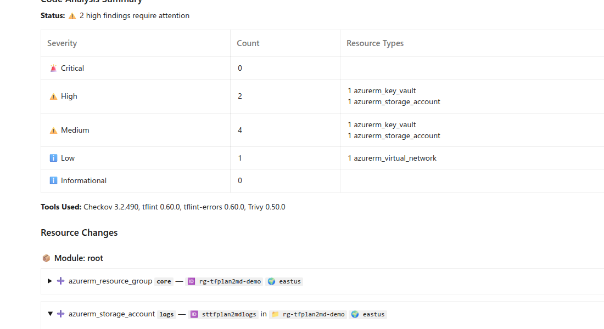
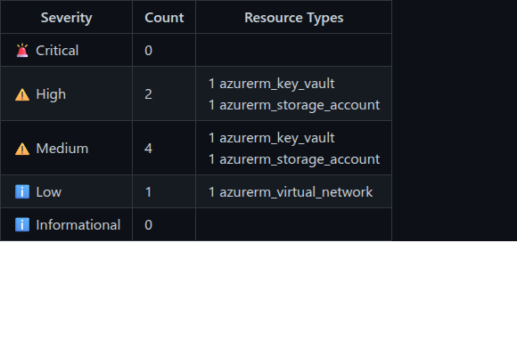

# Static analysis integration (SARIF)

This release adds optional static analysis integration: tfplan2md can ingest SARIF 2.1.0 results (e.g., Checkov/Trivy/TFLint) and surface findings directly in the plan report.

## ✨ Features

- **Code Analysis Summary** section with finding counts by severity and affected resource types.
- **Per-resource findings** shown inline (e.g., “🔒 Security & Quality: ⚠️ 1 High, ⚠️ 1 Medium”) with a findings table and remediation links.
- **New CLI flags** to control analysis input and behavior (see Getting started).

## 🐛 Bug fixes

- Handles certain corrupted SARIF inputs more robustly (e.g., concatenated/invalid content that previously broke parsing).

## 📸 Screenshots

### Example output

Light mode:



Dark mode:



## 🔗 Commits

- [`7ab53730`](https://github.com/oocx/tfplan2md/commit/7ab53730) feat: add SARIF parser foundation
- [`8a9f5f40`](https://github.com/oocx/tfplan2md/commit/8a9f5f40) feat(cli): implement static analysis CLI flags and wildcard expansion
- [`36de4dc5`](https://github.com/oocx/tfplan2md/commit/36de4dc5) feat: add static analysis UAT artifact and example SARIF files
- [`8af7277d`](https://github.com/oocx/tfplan2md/commit/8af7277d) fix: clean corrupted SARIF files (remove concatenated AWS content)

## ▶️ Getting started

Pass SARIF files to tfplan2md and optionally enforce a minimum severity / fail the run:

```bash
tfplan2md \
  --code-analysis-results "./results/**/*.sarif" \
  --code-analysis-minimum-level high \
  --fail-on-static-code-analysis-errors \
  plan.json > plan.md
```
