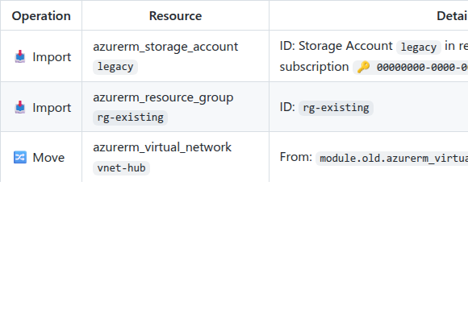
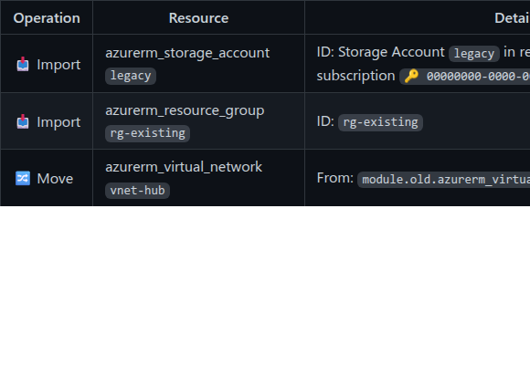

# Terraform refactoring visibility (import + moved blocks)

If your plan contains Terraform `import` or `moved` blocks, tfplan2md now makes those operations visible in the report (instead of silently looking like “normal adds”).

## ✨ Features

- **Refactoring Summary** section that lists import/move operations and their status in one place.
- **Inline annotations** on affected resources (e.g., imported / moved-from) so you can spot refactors while reviewing changes.
- **Warnings for no-op blocks** (e.g., an import block for a resource that is already imported), to help keep configuration clean.

No changes to how you run tfplan2md.

## 📸 Screenshots

### Refactoring Summary

Light mode:

Dark mode:

## 🔗 Commits

- [`dce70958`](https://github.com/oocx/tfplan2md/commit/dce70958) feat: add refactoring metadata to report model
- [`d20ec23c`](https://github.com/oocx/tfplan2md/commit/d20ec23c) feat: annotate summary lines for refactoring
- [`2c2c4a40`](https://github.com/oocx/tfplan2md/commit/2c2c4a40) feat: render refactoring summary section
- [`5e8f0e04`](https://github.com/oocx/tfplan2md/commit/5e8f0e04) feat: improve refactoring summary details
- [`1b21e8fc`](https://github.com/oocx/tfplan2md/commit/1b21e8fc) fix: align refactoring summary table formatting
