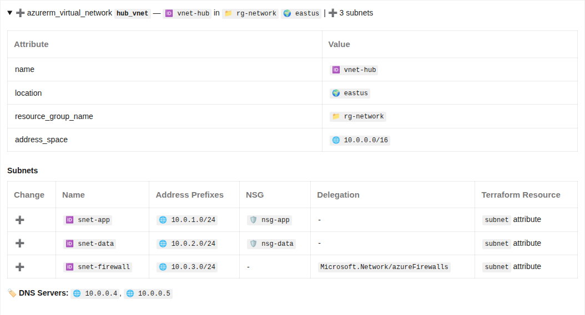
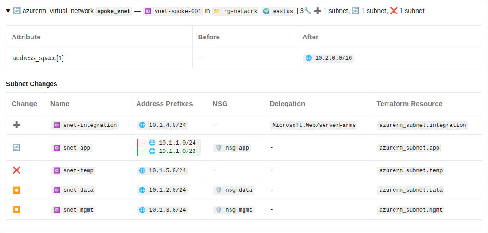
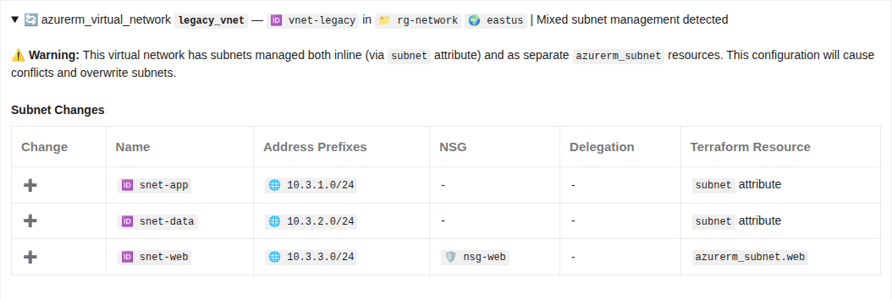
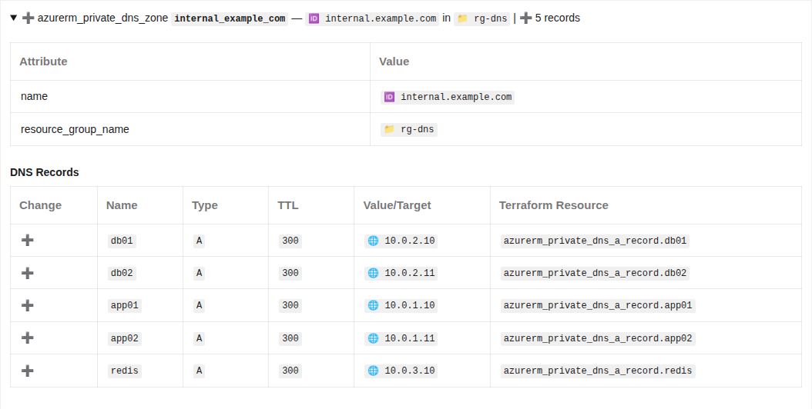
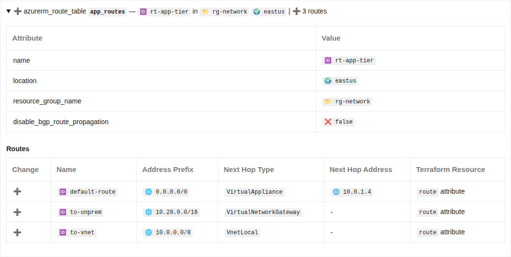

# Azure RM Parent-Child Resource Grouping

This release extends parent-child resource grouping to Azure RM resources, consolidating related resources (VNets/subnets, DNS zones/records, route tables/routes, NSG/rules) into unified tables with inline diffs and character-level change highlighting.

## ✨ Features

### Parent-Child Grouping for Azure RM Resources

Building on the parent-child framework introduced in Feature 068, this release adds support for four core Azure RM resource types that follow the parent-child pattern:

- **Virtual Networks & Subnets** (`azurerm_virtual_network` + `azurerm_subnet`): Subnets displayed as inline tables showing address prefixes, NSG associations, and delegations
- **Route Tables & Routes** (`azurerm_route_table` + `azurerm_route`): Routes displayed with address prefixes, next hop types, and next hop addresses
- **Network Security Groups & Rules** (`azurerm_network_security_group` + `azurerm_network_security_rule`): Security rules displayed with 11 columns including split source/destination addresses and ports
- **DNS Zones & Records** (`azurerm_dns_zone` + DNS record types, `azurerm_private_dns_zone` + private DNS record types): Records grouped by zone showing name, type, TTL, and values

### Character-Level Diff Highlighting

Inline diffs now show character-level changes with red/green highlighting for modified values:

- **Address changes**: `10.200.2.0/<span style="background-color: #ffc0c0">4</span>` → `10.200.2.0/<span style="background-color: #acf2bd">3</span>` (CIDR block size change)
- **Name changes**: Shows exactly which characters changed in resource names
- **HTML rendering**: Rich HTML formatting with styled backgrounds matching existing firewall rule templates
- **Simple diff format**: GitHub-compatible diffs with `<br>` tags for line breaks

### Mixed Management Detection

Enhanced warning system detects when resources have children managed both as inline attributes and separate Terraform resources:

```
⚠️ Warning: This resource has children managed both inline 
and as separate resources. This configuration will cause conflicts.
```

This helps identify potential configuration issues where Terraform will overwrite one set of children with the other.

### Improved Value Formatting

- **Backtick formatting**: All non-diff values wrapped in backticks for consistent code styling
- **Bare dash for nulls**: Empty/null values shown as plain `-` without code formatting
- **HTML diff preservation**: Diff values with HTML spans passed through without escaping
- **Icon prefixes**: Consistent emoji prefixes (🆔, 🌐, 📁, 🌍) for resource properties

### Conditional Column Display

The "Terraform Resource" column only appears when a parent resource has mixed management (some children inline, some separate). This keeps tables cleaner when all children are inline attributes.

## 🐛 Bug Fixes

### Markdown Linting Compliance

- **Trailing spaces**: Fixed Scriban template whitespace control to prevent trailing spaces after table pipes
- **Table structure**: Proper newline preservation ensures each table row on separate line
- **Markdownlint validation**: All generated markdown passes `markdownlint-cli2` validation with 0 errors

### Raw Value Extraction

Fixed HTML tag escaping in diffs by extracting raw values (icons only, no backticks) before passing to `FormatDiff`. This prevents HTML spans from being wrapped in backticks and rendered as literal text.

### Simple Diff Pattern Detection

Added pattern detection in `FormatChildValue` to recognize `"- value<br>+ value"` format and pass through without backtick wrapping, allowing `<br>` tags to render as line breaks in tables.

## 📚 Documentation

- Updated parent-child resource catalog with implementation status
- Added rendering examples showing all four Azure RM resource types
- Updated architecture documentation with template whitespace control patterns
- Comprehensive UAT test plan covering all supported scenarios

## 📸 Screenshots

### Virtual Network with Inline Subnets (Create)

Shows subnets rendered as inline table with address prefixes, NSG associations, and delegations:



### Virtual Network with Separate Subnets & Character-Level Diffs (Update)

Shows mixed inline/separate subnets with character-level highlighting for address prefix changes:



### Mixed Management Warning

Shows warning indicator when resource has both inline and separate child resources:


### Network Security Group with Rules (11-Column Table)

Shows security rules with split source/destination columns for addresses and ports:



### Route Table with Routes

Shows routes with address prefixes, next hop types, and next hop addresses:



### DNS Zone with Records

Shows DNS records grouped by zone with name, type, TTL, and values:



## 🔗 Commits

User-facing commits:

- [`b33d08a`](https://github.com/oocx/tfplan2md/commit/b33d08a) fix: correct table rendering - no trailing spaces, proper newlines
- [`98d559c`](https://github.com/oocx/tfplan2md/commit/98d559c) fix: remove trailing spaces from _child_resources.sbn template
- [`74f93d7`](https://github.com/oocx/tfplan2md/commit/74f93d7) fix: revert to <br> tags in simple diffs, add detection in FormatChildValue
- [`9f0db75`](https://github.com/oocx/tfplan2md/commit/9f0db75) fix: bare dash without code tags, newlines instead of br in GitHub diffs
- [`9707d52`](https://github.com/oocx/tfplan2md/commit/9707d52) fix: remove backticks from raw values before HTML diff generation
- [`9c1079d`](https://github.com/oocx/tfplan2md/commit/9c1079d) fix: add backticks to all non-diff values, preserve HTML diffs
- [`022a31f`](https://github.com/oocx/tfplan2md/commit/022a31f) feat: implement parent-child grouping for Azure RM batch 2

## 🚨 Breaking Changes

None. This is a pure addition - existing templates and features continue to work unchanged. The parent-child grouping framework gracefully handles resources without parent-child relationships by falling back to standard rendering.

## ▶️ Getting Started

This feature is enabled by default for all supported Azure RM resource types. No additional configuration or flags are required.

### Supported Resource Types

- `azurerm_virtual_network` + `azurerm_subnet`
- `azurerm_route_table` + `azurerm_route`
- `azurerm_network_security_group` + `azurerm_network_security_rule`
- `azurerm_dns_zone` + `azurerm_dns_*_record`
- `azurerm_private_dns_zone` + `azurerm_private_dns_*_record`

### Usage Example

```bash
# Generate report with parent-child grouping
tfplan2md plan.json -o report.md

# Docker
docker run -v $(pwd):/data oocx/tfplan2md /data/plan.json -o /data/report.md
```

The tool automatically detects parent-child relationships and renders them as inline tables when:
1. A parent resource has inline child attributes (e.g., `subnet` blocks in `azurerm_virtual_network`)
2. Separate child resources reference the parent (e.g., `azurerm_subnet` resources with matching VNet ID)
3. Mixed scenarios where both inline and separate children exist

## 🔮 Future Enhancements

Potential additions for future releases:
- Azure AD groups with members (`azuread_group` + `azuread_group_member`)
- Azure DevOps groups and teams with members
- Azure RM firewall policy rules
- Azure RM application gateway rules
- Other provider resources following the parent-child pattern

See [`parent-child-resource-catalog.md`](parent-child-resource-catalog.md) for the full list of cataloged parent-child patterns.
