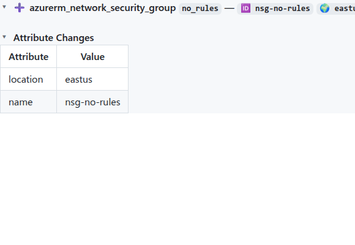
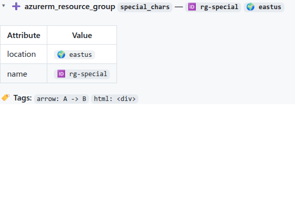

# NSG rendering and markdown escaping bug fixes

This release is a small set of fixes for AzureRM Network Security Group (NSG) and Firewall rule rendering. No new features, just correctness + output cleanup.

## 🐛 Bug fixes

- Inline code escaping: values containing `>` are no longer rendered with a visible escape (`\>`) inside code spans.
- NSG / Firewall create output: create/add actions now render a single `Value` column instead of an empty `Before` column.
- NSG template output: removes duplicate resource identification lines in the NSG semantic template.

## 📸 Screenshots

### Create output uses a single `Value` column

### Inline code no longer shows escape backslashes

## 🔗 Commits

- [`ca27b9b`](https://github.com/oocx/tfplan2md/commit/ca27b9b1116230c431b727765fab108308d71438) fix: address NSG rendering and escaping issues found in UAT
