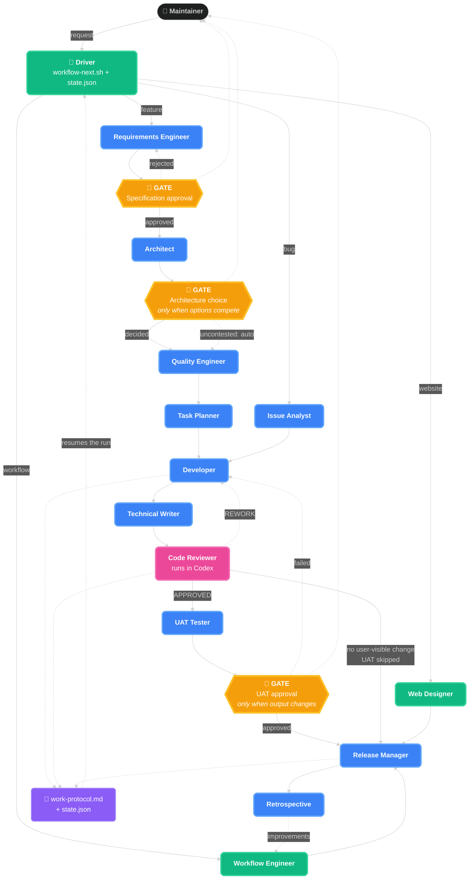

# Workflow

How work moves from a request to a release. [AGENTS.md](../AGENTS.md) covers project
rules; this file covers stages, gates and artifacts. Role definitions live in
`.agents/roles/`.

The workflow runs unattended between gates. Roles do not decide the sequence — it comes
from `state.json`, resolved by `scripts/workflow-next.sh`.

## Workflow diagram

This diagram is the source for the website's `ai-workflow.svg`. Regenerate it with the
`update-workflow-diagram` skill after changing it.



## Stages

### Feature — `feature/NNN-<slug>` → `docs/features/NNN-<slug>/`

| # | Role | Produces |
|---|------|----------|
| 1 | Requirements Engineer | `specification.md`, `work-protocol.md`, `state.json` |
| — | **GATE: specification approval** | always human |
| 2 | Architect | `architecture.md`, `docs/adr-*.md` |
| — | **GATE: architecture choice** | only when options genuinely compete |
| 3 | Quality Engineer | `test-plan.md`, `uat-test-plan.md` |
| 4 | Task Planner | `tasks.md` |
| 5 | Developer | code, tests, `uat-plan.json`, `uat-plan.md` |
| 6 | Technical Writer | updated global documentation |
| 7 | Code Reviewer | `code-review.md` + verdict |
| 8 | UAT Tester | UAT PRs in GitHub and Azure DevOps, `uat-report.md` |
| — | **GATE: UAT** | only when user-visible output changed — decided after the PRs exist |
| 9 | Release Manager | PR, `release-notes.md`, the release |
| 10 | Retrospective | `retrospective.md` |

### Bug fix — `fix/NNN-<slug>` → `docs/issues/NNN-<slug>/`

Issue Analyst (`analysis.md`) → Developer → Technical Writer → Code Reviewer →
UAT Tester (if applicable) → Release Manager → Retrospective.

### Workflow improvement — `workflow/NNN-<slug>` → `docs/workflow/NNN-<slug>/`

Workflow Engineer → Release Manager. UAT does not apply.

### Website — `website/NNN-<slug>` → `docs/website/NNN-<slug>/`

Web Designer → Release Manager.

## Gates

Three, and only three. Everything else runs unattended.

| Gate | Fires | Decided by |
|------|-------|-----------|
| Specification | Every feature | Always the Maintainer |
| Architecture | Two or more viable options with material trade-offs | Maintainer; otherwise the Architect decides and records the ADR |
| UAT | The diff touches user-visible output | Maintainer's explicit pass/fail, **after** the UAT Tester has created the PRs |

The UAT gate is a path rule, not a judgement:

```bash
git diff --name-only origin/main...HEAD | grep -qE \
  '^(src/Oocx\.TfPlan2Md/(MarkdownGeneration|RenderTargets)/|examples/|website/)'
```

A change to parsing, CLI wiring, tests, documentation or the workflow itself never
triggers UAT. A change to rendering, render targets, bundled examples or the website
always does.

### Away from a gate, nothing blocks

A role that hits ambiguity records the question **and the assumption it is proceeding
on** into `state.json` → `open_questions`, then continues. The list surfaces at the next
gate and in the PR description.

This is deliberate. The previous rule — ask one question at a time and wait — made
unattended runs impossible. Blocking is now correct only at a gate.

## State

Each work item carries `state.json`:

```json
{
  "type": "feature",
  "slug": "NNN-example",
  "stage": "review",
  "status": "running",
  "gates": { "spec": "approved", "arch": "auto", "uat": "required" },
  "attempts": { "review": 2 },
  "open_questions": [ { "q": "...", "assumed": "...", "raised_by": "..." } ]
}
```

`stage` is the role that runs next. `attempts` counts rework loops and drives model
escalation — a role at attempt 2 or later runs one tier deeper. `status` is `running`,
`blocked` or `done`.

State on disk is what makes an unattended run resumable: a session that compacts or dies
loses nothing, because the next stage is a script call rather than a memory.

## Rework loops

| Failure | Returns to |
|---------|-----------|
| Code review verdict `REWORK` | Developer |
| UAT failed | Developer |
| PR Validation or release build failed | Developer |
| Rework reveals a specification gap | Requirements Engineer |

The Developer re-enters with the report, fixes the named findings, and re-runs the
verification that failed. `attempts` increments each time.

## Work protocol

`work-protocol.md` is the audit trail. The first role in the workflow creates it; every
role appends an entry on completion. `scripts/workflow-gate.sh work-protocol` blocks
release when a required role has no entry.

Required roles by workflow type:

| Workflow | Required entries |
|----------|-----------------|
| Feature | Requirements Engineer, Architect, Quality Engineer, Task Planner, Developer, Technical Writer, Code Reviewer |
| Bug fix | Issue Analyst, Developer, Technical Writer, Code Reviewer |
| Workflow | Workflow Engineer |

UAT Tester and Retrospective are required when they apply, and are not gate-blocking.
Neither is the Release Manager: it runs the completeness check *before* doing its work,
so it cannot require its own entry.

## Work item numbering

`NNN` is global and monotonic across features, issues and workflow items. Never reuse a
number across types.

On a parallel-work collision, the first PR to merge keeps the number; the later one
renumbers its folder and updates affected intra-doc links before merge.

## Code review runs in Codex

The Code Reviewer role executes through `scripts/codex-review.sh` in a different model
family from the author, so the review tests the code rather than ratifying the reasoning
that produced it. The review must end with `VERDICT: APPROVED` or `VERDICT: REWORK`; the
driver parses that line and treats anything else as `REWORK`.

If `codex` is unavailable the wrapper retries once, then falls back to a Claude reviewer
and records `reviewer: claude-fallback` in `work-protocol.md`.
